# W600 开发环境搭建指南

本文档旨在指导用户创建 W600 的软件环境。本文将通过一个简单的例子来说明如何使用 W600 进行应用开发，包括环境配置、程序编译、固件下载等步骤。

## **1 概述**

W600是联盛德新一代支持多接口、多协议的无线局域网802.11n（1T1R）低功耗 WLAN SoC 芯片。芯片内置 Cortex-M3 CPU处理器和Flash，集成射频收发前端RF Transceiver，CMOS PA功率放大器，基带处理器/媒体访问控制，集成电源管理电路，支持丰富的外围接口， 支持多种加解密协议。W600提供给客户的二次开发空间更大、芯片外围电路器件更少、开发更简便，性价比更优势。

W600芯片只有5mm x 5mm 大小，但集成度非常高。芯片内部集成了 RF Switch、Balun、低噪声放大器、滤波器、功率放大器、电源管理模块等，此外还内置了1MByte Flash，使得芯片外围电路器件更少，且模块体积更小、成本更优。W600不仅提供了更加丰富的接口和更大的内存空间，还集成了各种加解密硬件加速器，可提供更快的加解密算法执行速度。芯片采用业界通用的 Cortex-M3 处理器，代码可移植性更强、开发环境友善。

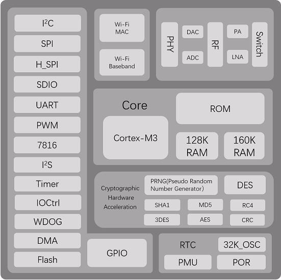

## **2 准备工作**

**·** **电脑**: 开发环境支持Keil 和GCC

**·** **SDK**: [W600 最新SDK](https://github.com/w600/sdk)

**·** **keil工具链**: MDK （Keil 开发）

**·** **gcc开发环境**: [eclipse + cygwin+ gcc](https://eyun.baidu.com/s/3ghjX5xL)

**·** **TB-01 开发板**（[购买链接](http://shop.thingsturn.com/)）

**·** **Micro USB 线**（需支持数据传输）

## **3 开发板介绍**

TB-01 是一款基于联盛德 W600 的超小体积核心开发板，该开发板引出了芯片的所有IO，并且内置LDO和UART传输芯片，只需一根 Micro USB 数据线与电脑连接即可使用，支持一键下载，外设拥有5个环形LED和2颗按键，调试操作极其方便。

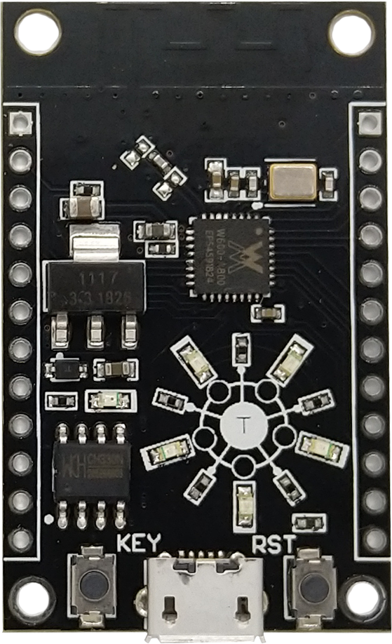

## **4 KEil 环境搭建**

### **4.1 安装MDK 环境搭建**

由于 SDK 需要 Cortex-M3 的 Device Pack 支持，如果在线下载速度较慢 或 安装遇到问题，建议安装 [MDK 5](https://www.keil.com/download/product/) 的同时也安装对应的 [Legacy 版本](http://www.keil.com/mdk5/legacy/)

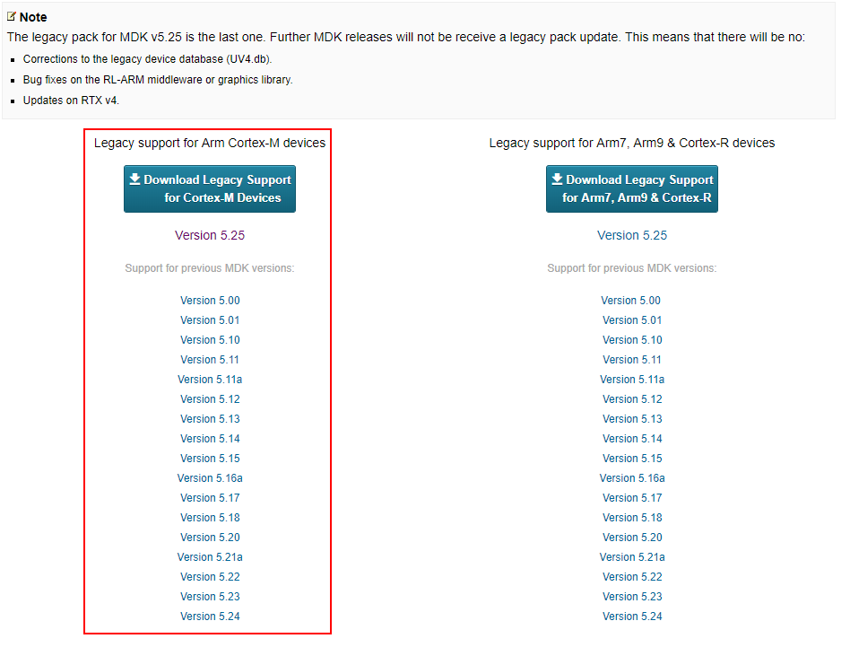

### **4.2 打开工程**

打开下载的SDK工程，找到 **\SDK\Tools\Keil\Project\WM\_W600.uvproj** 文件并打开

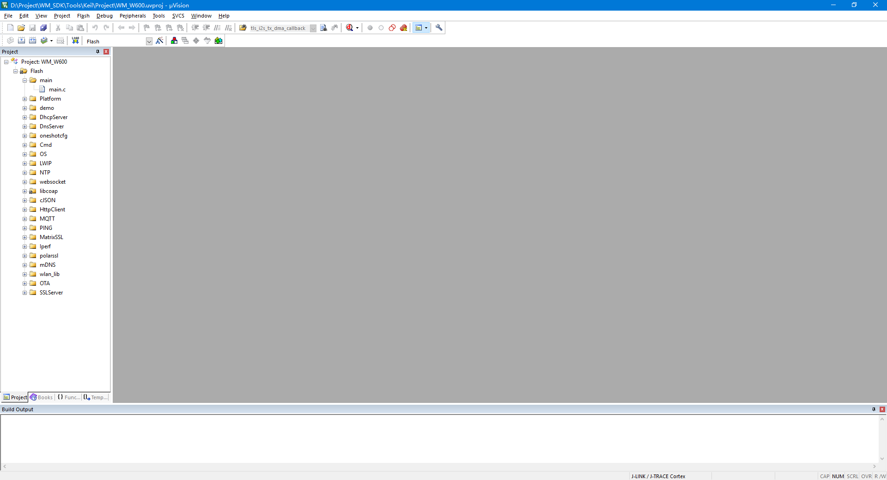

注意：若提示工程打开失败，请检查 MDK 是否按照上一章节进行正确配置

### **4.3 修改 Demo 示例**

找到main.c，此处的 void UserMain(void) 是用户程序的函数入口

修改 SDK 打印信息

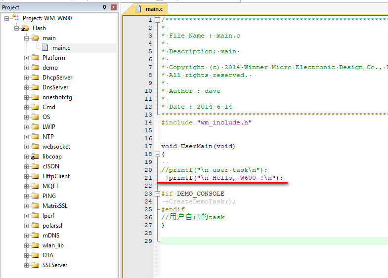

### **4.4 编译**

点击菜单栏可进行编译

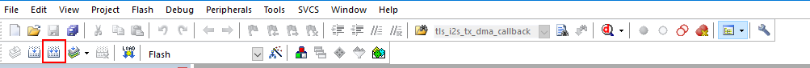
控制台窗口输出如下：

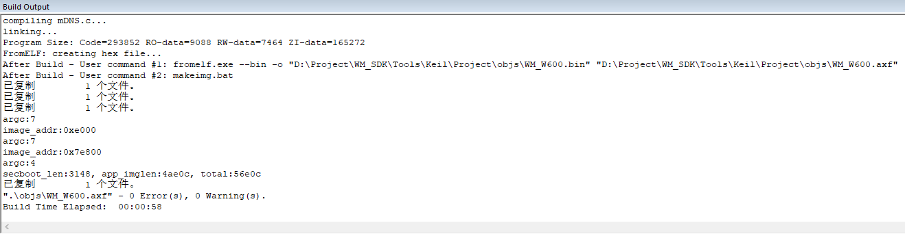

## **5.GCC环境搭建**

### **5.1 安装**

双击下载的 W600_IDE_Setup.exe ,如图，自行选择要解压的目录；

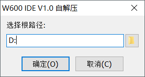

解压后的目录如下

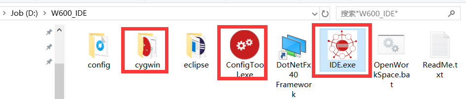

### **5.2 配置**

1.  点击 **ConfigTool.exe** 弹出配置界面；

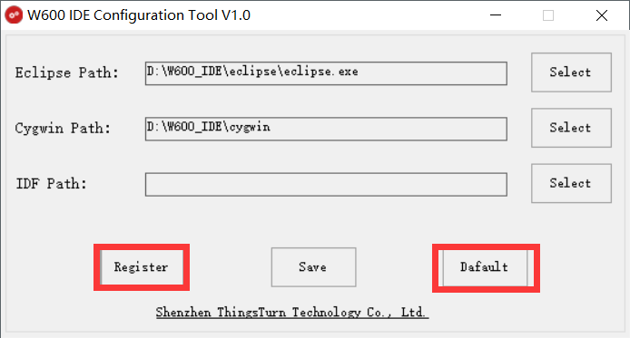

2.  点击 Default 按键，自动搜寻Eclipse Path 和 Cygwin Path路径；

3.  点击 Register 注册 cygwin；

4.  点击保存，使配置生效。可以在任何目录下，右键打开cygwin命令框。

### **5.3 导入新工程**

双击 **IDE.exe** 打开IDE应用程序, IDE内置了一份W600的SDK，不是最新版本，建议更新

1.  点击 **file-> import**

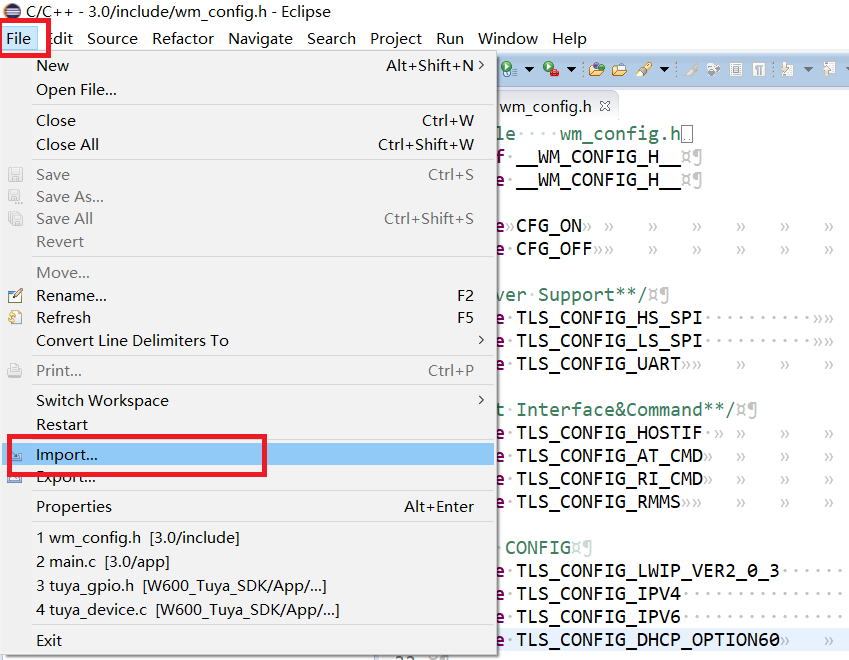

2.  点击 **C/C++**，选择 **Existing Code as Makefile Project**

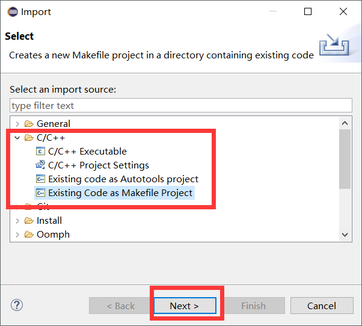

3.  去除 **C++** 支持，选择 **Cygwin GCC** ; 点击 **Browser** , 选中我们之前下载好的SDK工程

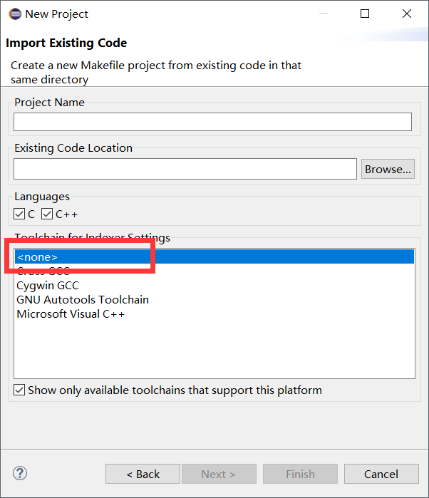

4.  点击Finish完成工程的导入

### **5.4 编译**

右键需要编译的工程,点击 **Clean project**, 清除完后再右键工程，点击 **Build Project** 即可，出现 Build fininsh！则编译正常无误，可以烧录固件。

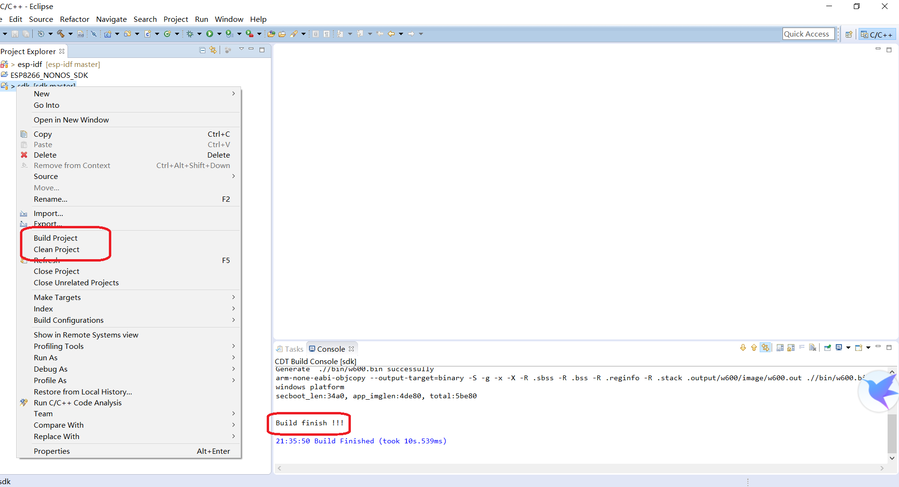 

## **6.固件烧录与调试**

**注意：由于我们在硬件上将 W600 的 RESET 引脚和串口芯片的 RTS 引脚连接在了一起，当您在使用其它串口工具（如 SecureCRT）时，需要去掉开发板上面的 R100 电阻，否则串口可能会无输出。**

固件烧录和调试需依赖[星通智联串口调试助手](https://docs.w600.fun/?p=tools/serial.md)

### **6.1 连接设备**

1. 将开发板与电脑通过 Micro USB 线进行连接
2.  打开星通智联串口调试助手
3. 打开对应的串口，并点击 **复位设备**(或按下 RST 按键) 进行设备复位
4. 串口打印信息如下，说明开发板正常工作
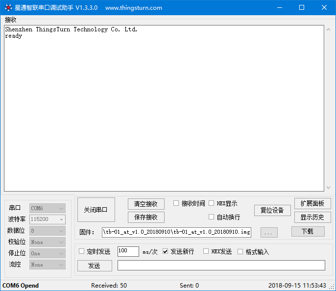

**如有异常，请参考以下方法进行检查**

* 检查拔插设备时**设备管理器**是否有变化（变化部分为串口），并检查 [串口驱动](http://wch.cn/downloads/file/65.html) 是否安装成功；
* 若未能发现新增串口，请尝试更换一根 Micro USB 数据线；
* 出现其它打印信息内容或者乱码，请联系对应的销售人员或技术支持人员；

### **6.2 固件烧录及运行**

1. 选择对应的固件，支持 FLS 和 img 格式；FLS 是 WM_W600_sec.img + secboot.img 的合并文件，一般用于芯片的首次下载，之后仅烧录 WM_W600_SEC.img即可。

2.  点击“下载”进行固件下载，波特率默认使用 115200 bps，支持 2Mbps！； 烧录遇到问题的用户请参考:[W600固件烧录指南](https://docs.w600.fun/?p=app/download.md)

3.  观察固件运行信息

 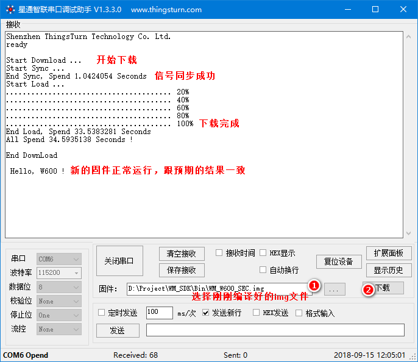

### **结束**

恭喜！你已完成 W600的入门！

现在你可以尝试其他的示例工程或者直接开发自己的应用程序。
