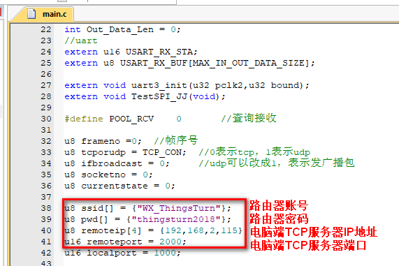
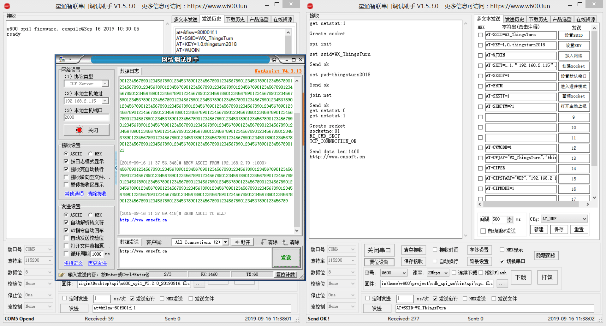

# 基于RI指令集的SPI调试指南

## 准备

STM32F103C8T6 开发板 * 1

TB-01开发板 * 1

100 欧姆电阻 * 5 （`非必须，加上后传输会稳定很多`） 

## 连接

`注意：新版本固件已默认设置AT+PORTM=2，无需再次手动通过串口发送该指令。`

**SPI接线描述**

| PIN  | STM32 | W600（SPI_0） |  W600（SPI_1）   |
| :--: | :---: | :--: | :--: |
| INT  |  PA2  | PB14 | PB09 |
|  CS  |  PA4  | PB15 | PB10 |
| CLK  |  PA5  | PB16 | PB08 |
| MOSI |  PA7  | PB17 | PB11 |
| MISO |  PA6  | PB18 | PB12 |

**STM32 UART 接线（串口1）**
波特率 115200，8，N，1，可查看打印的日志信息。

| STM32 | USB转TTL |
| :---: | :------: |
|  PA9  |    RX(PA5)    |
| PA10  |    TX    |
|  GND  |   GND    |

修改STM32 Demo 程序，找到 main.c，把要连接的SSID和密码修改成实际的SSID和密码，通信地址的IP地址和端口修改为电脑端实际的TCP Server的IP地址和端口。

重新编译STM32代码并烧录。运行如下图：

（左边为w600，右边为stm32）

## 注意

部分客户反馈测试时，经常会收到SPI数据 0x00，这个问题一般是由于信号传输不稳定导致的，

1.  在 CLK，MISO，MOSI 连接线上串一个100欧姆的电阻；
2.  不要使用杜邦线，或者接线尽可能短；
3.  W600 电源单独供电，确保3.3V@500mA以上。

## 资料下载

[W600 SPI0 固件下载](https://download.w600.fun/firmware/w600_spi0_v3.2.0_20190916.fls)

[W600 SPI1 固件下载](https://download.w600.fun/firmware/w600_spi1_v3.2.0_20190916.fls)

[STM32 Demo 程序下载](https://download.w600.fun/firmware/stm32_spi_code.7z)

[W600 RI 指令集手册下载（较旧，仅供参考，新的文档还在整理中）](https://download.w600.fun/document/RI%E6%8C%87%E4%BB%A4%E7%94%A8%E6%88%B7%E6%89%8B%E5%86%8C.pdf)

