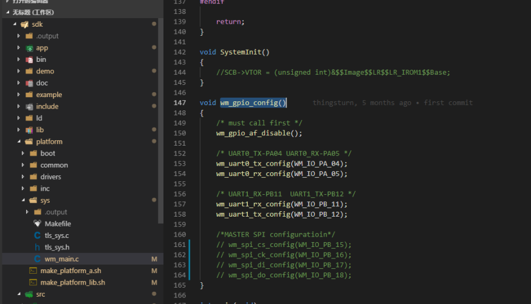
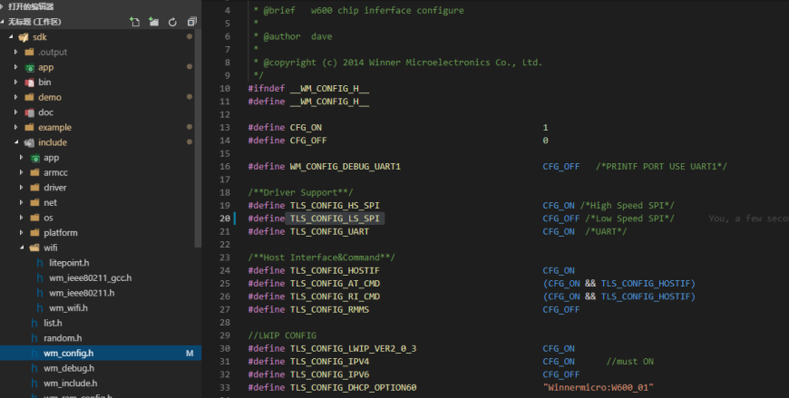
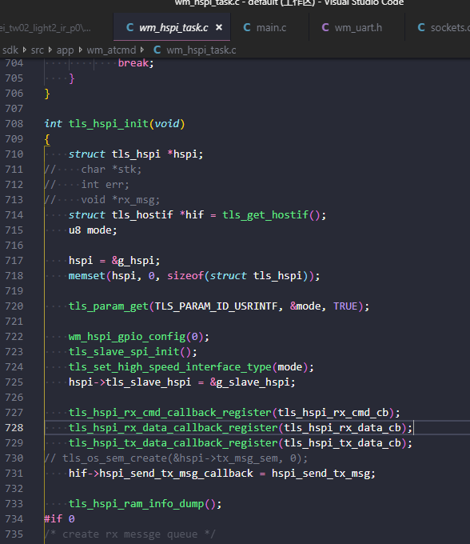
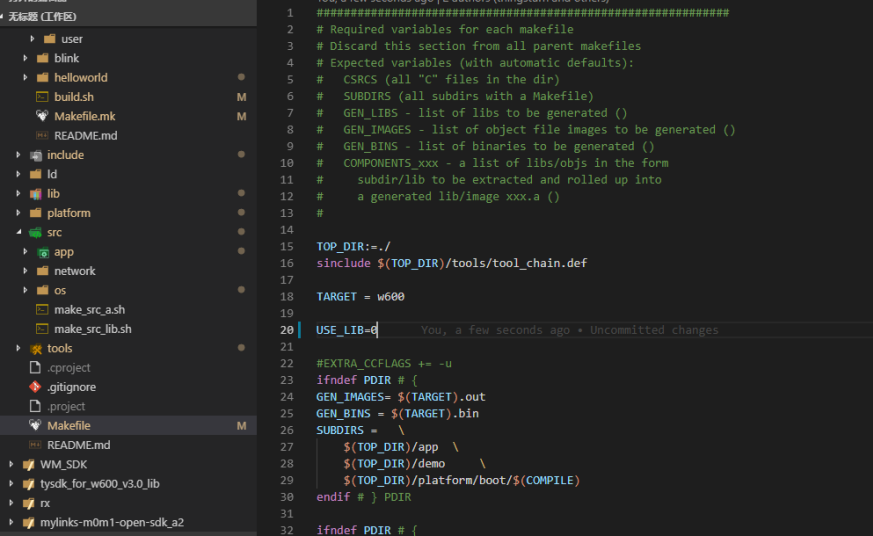
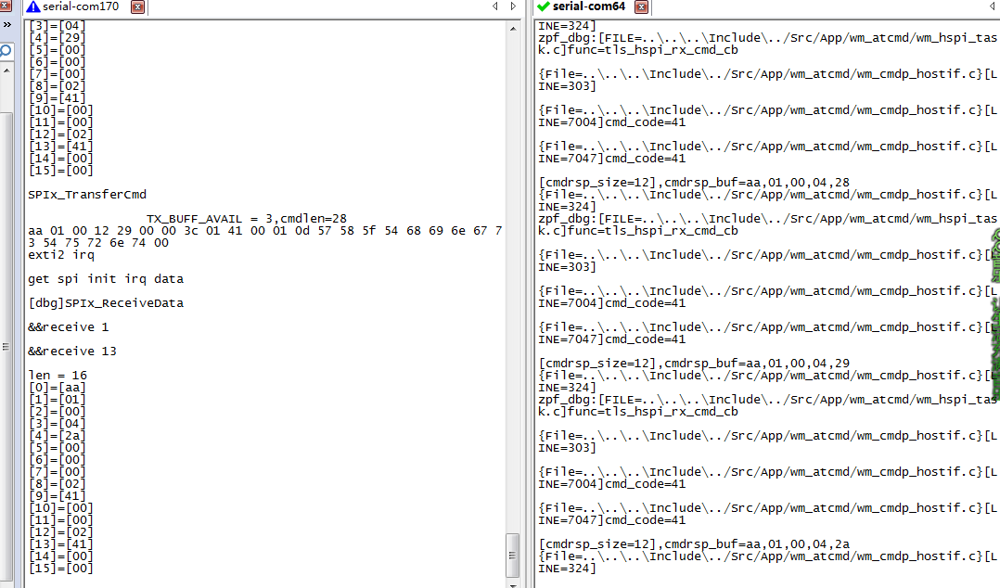
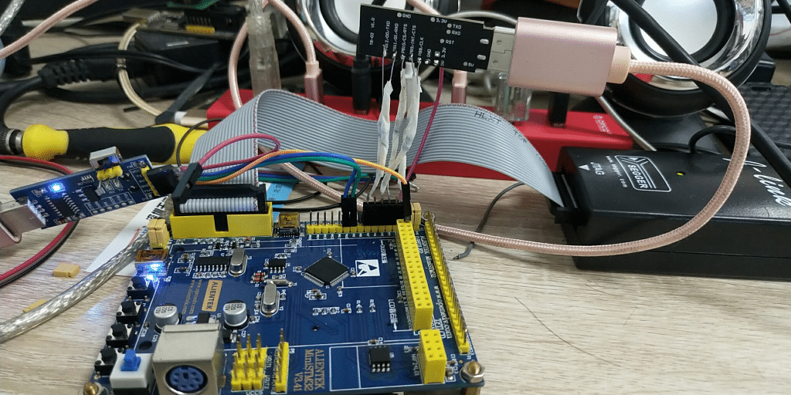

# 基于RI指令集的SPI调试指南

## 准备

STM32F103C8T6 开发板 * 1

TB-01开发板 * 1

100 欧姆电阻 * 5 （`非必须，加上后传输会稳定很多`） 

## 步骤

1.  修改 /platform/sys/wm_main.c ，Line 147：wm_gpio_config() 里面屏蔽 主spi配置；

2.  修改 include/wm_config.h ，Line 20：关闭低速SPI ；
    

3.  修改 sdk/src/app/wm_atcmd/wm_hspi_task.c，Line 722：选择使用哪一组 SPI 引脚；
 

4.  修改根目录下的 Makefile， Line 20：USE_LIB=0 不链接lib。

5.  重新编译固件，并烧录；

6.  打开W600串口0或者串口1，配置为115200, 8, N, 1，串口发送 AT+PORTM=!2 ，使能W600的SPI接口模式；

7.  连接 STM32 和 W600，连接STM32串口观察打印信息；

**SPI接线描述**

| PIN  | STM32 | W600（SPI_0） |  W600（SPI_1）   |
| :--: | :---: | :--: | :--: |
| INT  |  PA2  | PB14 | PB08 |
|  CS  |  PA4  | PB15 | PB09 |
| CLK  |  PA5  | PB16 | PB10 |
| MOSI |  PA7  | PB17 | PB11 |
| MISO |  PA6  | PB18 | PB12 |

**STM32 UART 接线（串口1）**
波特率 115200，8，N，1，可查看打印的日志信息。

| STM32 | USB转TTL |
| :---: | :------: |
|  PA9  |    RX(PA5)    |
| PA10  |    TX    |
|  GND  |   GND    |

8.  打印信息如下：

## 注意

部分客户反馈测试时，经常会收到SPI数据 0x00，这个问题一般是由于信号传输不稳定导致的，建议在 spi 通信连接线上串一个100欧姆的电阻，另外使用杜邦线时接收会不稳定，最好是直接焊接上去，如下图：

## 资料下载

W600 SPI 测试固件下载：

STM32 Demo 程序下载：

W600 RI 指令集手册下载：