# W600 无线透传调试工具使用指南

## 概述

本工具通过调用底层自由收发包接口，可以实现指定通道，速率，接口，地址的无线双向透传，可用于数据无线打印传输，模组性能测试，点对点无线传输通信，广播无线传输通信等场景。

## 快速上手

### 准备

* [W600串口下载调试助手](https://download.w600.fun/tool/%E6%98%9F%E9%80%9A%E6%99%BA%E8%81%94%E4%B8%B2%E5%8F%A3%E8%B0%83%E8%AF%95%E4%B8%8B%E8%BD%BD%E5%8A%A9%E6%89%8B.7z)
* [W600无线透传调试工具](https://download.w600.fun/tool/ThingsTurn_Wireless_Config_Tools.7z)
* [W600无线透传固件](https://download.w600.fun/firmware/thingsturn_tb02_firmware_20190821.fls)
* [TB-02 开发板](http://shop.thingsturn.com)  * 2
* Windows PC * 1
### 固件烧录

按照下图说明对2块w600开发板进行下载，更多细节可查看 [w600固件烧录指南](https://docs.w600.fun/?p=app/download.md)

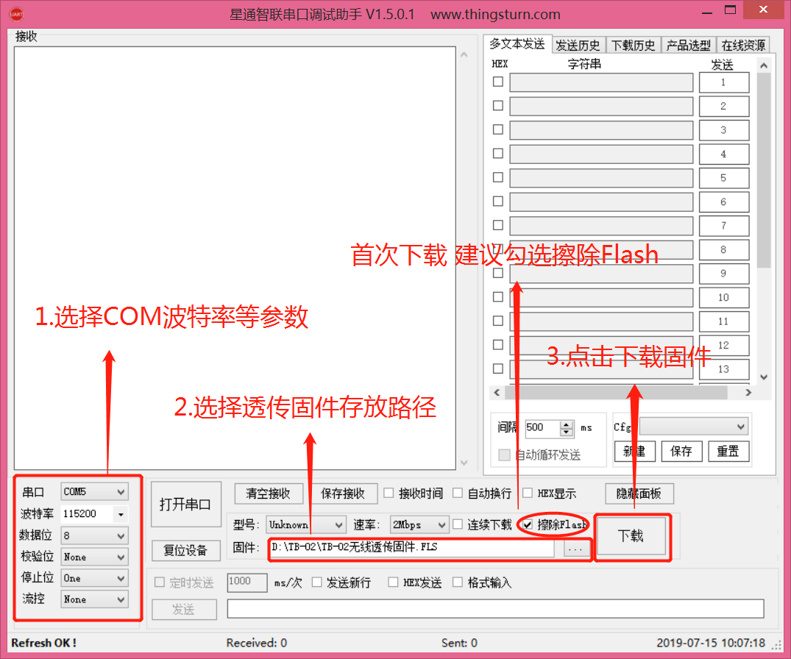 

下载完毕后：
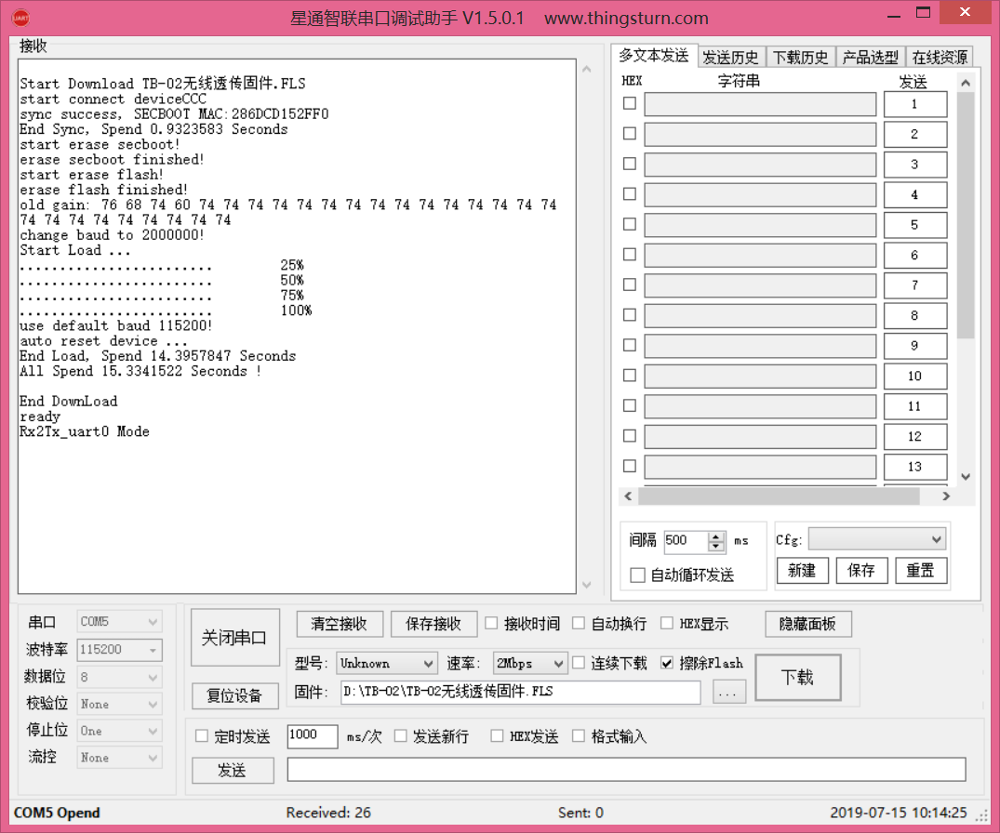 

### 固件测试

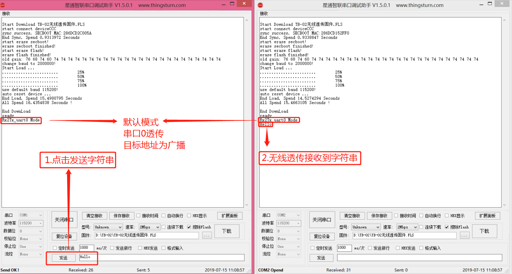

## 配置说明

### 面板介绍

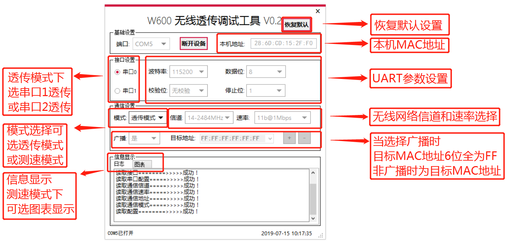 

注：W600无线透传调试工具需要配合TB-02无线透传固件.FLS使用，所以使用该工具前，务必烧录好TB-02无线透传固件后使用。

### 基础设置

打开W600无线透传调试工具，选择正确的COM端口，并点击【连接设备】

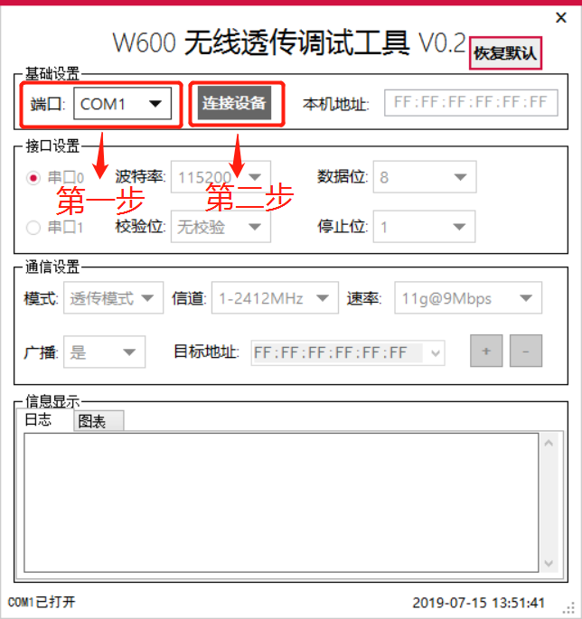 

软件会自动读出当前的配置信息，以及当前本机的MAC地址信息：

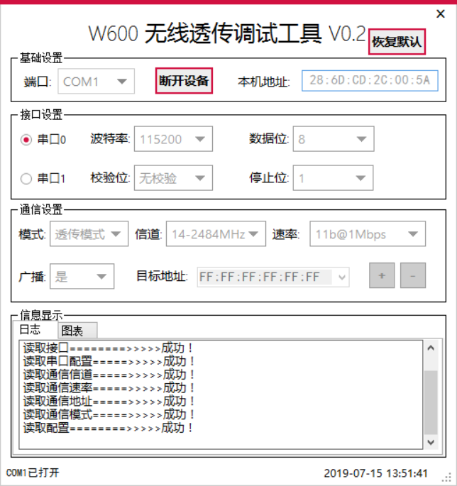 

 

### 接口设置

 

默认使用串口0，可通过电脑USB转TTL直接透传。当设置为串口1时，需自行连接板子上预留的UART1接口

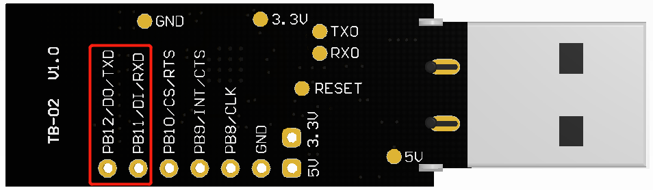 

### 通信设置

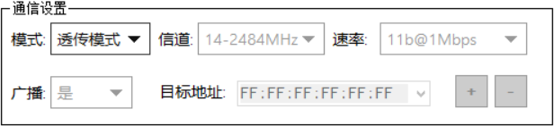 

**模式：**目前可选透传模式和测速模式

`注：测速模式下，仅通过UART0打印测速信息。`

**信道：**1-14 

1~14信道均可选择，但14信道干扰较小，通信效果会相对较好。

`注：模块通信时需要选择相同的信道，否则可能无法接受到透传数据。`

**速率：**由低到高排序

`要求通信距离远且稳定建议使用11b@1Mbps；追求速率可用11g@12Mbps，更高速率不建议使用，距离较短且容易丢包，功耗也会更大！建议根据实际所需情况挑选合适的速率`

**是否广播：**

选择“是”时，通信方式为广播方式，目标MAC  6位地址全为FF

此时模块向当前设置的信道的所有WIFI设备发送通信消息

 

选择“否”时，通信方式为点对点通信，此时需要手动填写目标的MAC地址（即目标设备的本机地址），并点击【+】使地址保存，此时模块仅向目标地址的WIFI设备发送通信消息。

 

## 配置示例

### 传输速度测试示例

1. 点击连接设备

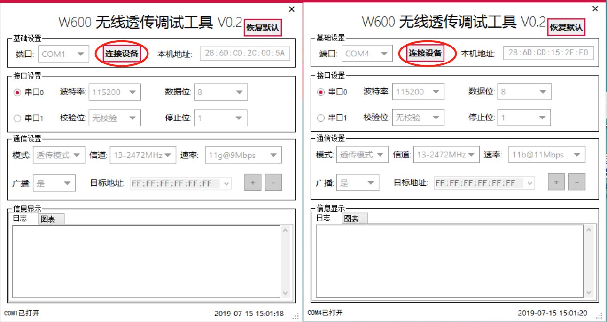 

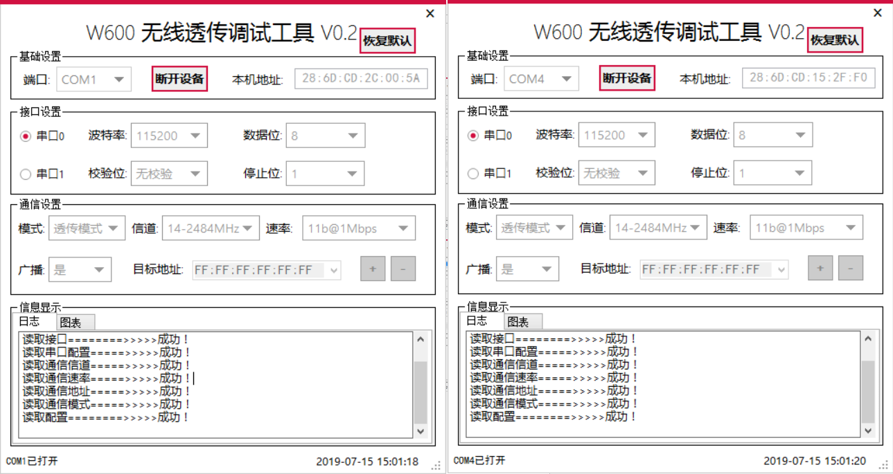 

2. 配置测速模式

COM1 配置为 【测试-TX】， COM2配置为 【测试-RX】

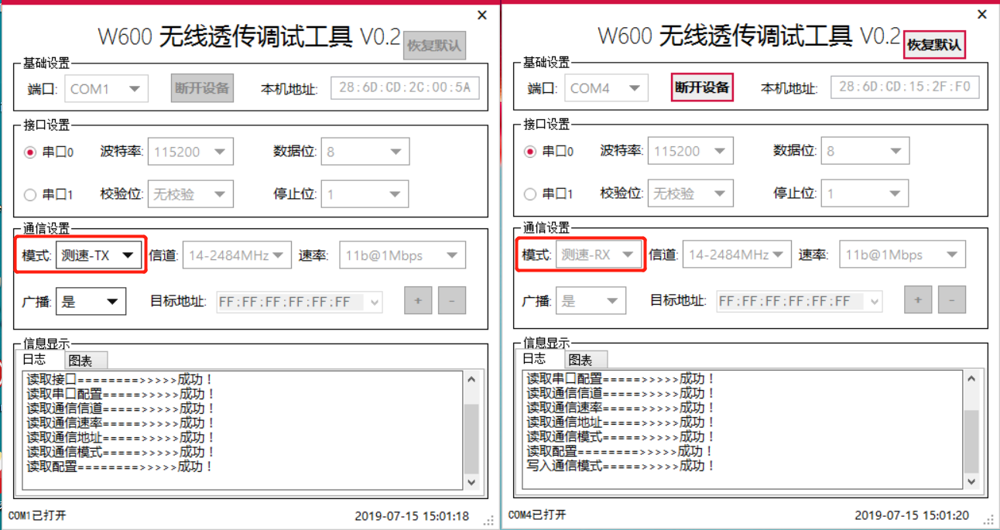 

测速信息：

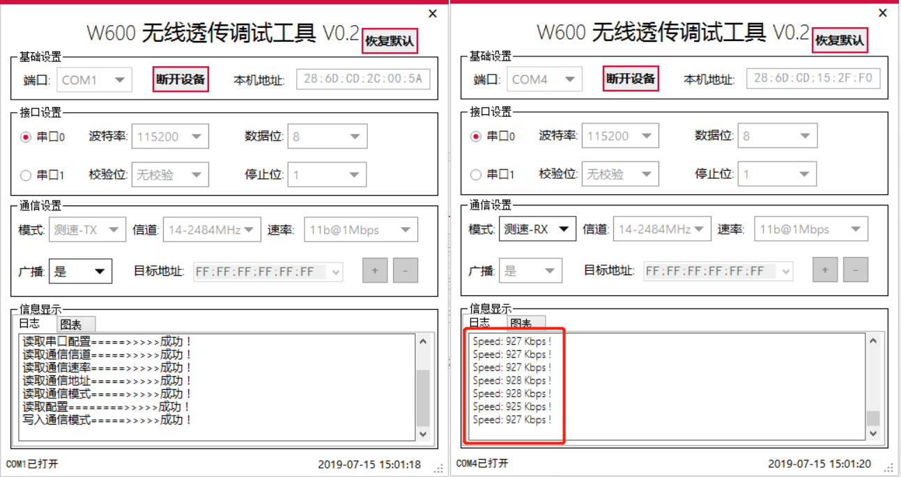 

测速图表：

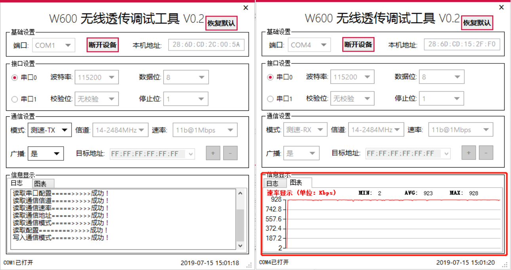 

3. 更改速率为**11g@9Mbps**

观察速率变化情况

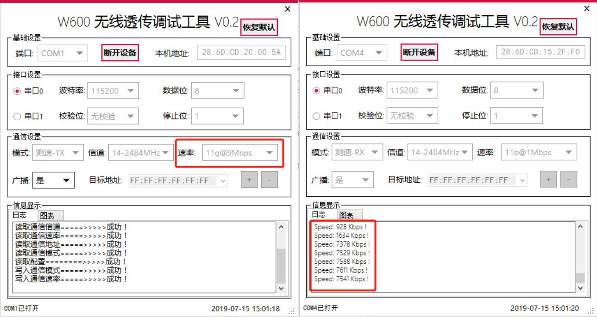 

###  修改透传参数示例

此处有2个设备，分别对应COM1和COM2，点击连接设备，并按照如下参数表分别对其进行配置。

|          |       COM1        |       COM2        |
| :------: | :---------------: | :---------------: |
|  波特率  |       9600        |      230400       |
| 通信模式 |       透传        |       透传        |
|   信道   |         1         |         1         |
|   速率   |     11b@1Mbps     |     11b@2Mbps     |
|   广播   |        否         |        否         |
| 本机地址 | 28:6D:CD:15:2F:F0 | 28:6D:CD:2C:00:5A |
| 目标地址 | 28:6D:CD:2C:00:5A | 28:6D:CD:15:2F:F0 |

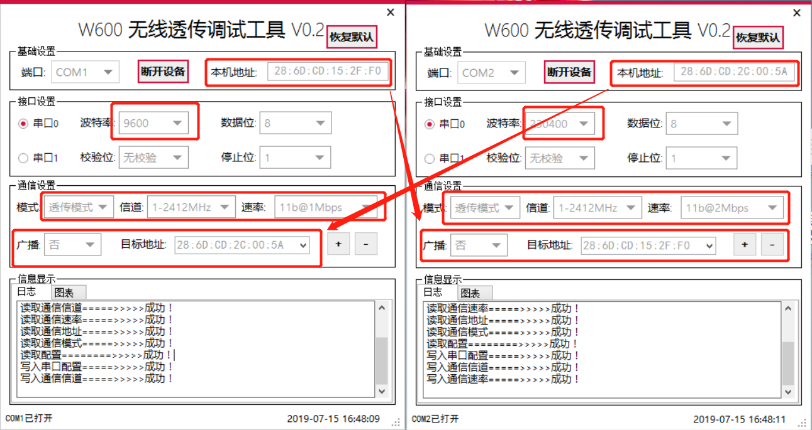 

关闭配置软件，并按照修改后的串口配置打开星通智联串口调试助手，此时双方可以进行双向串口透传通信。

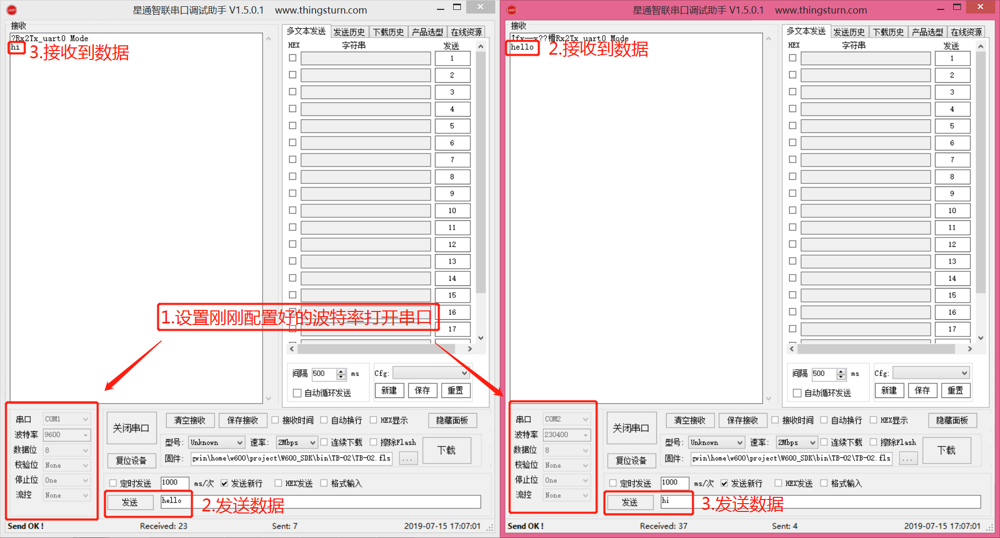 

## 常见问题

**1 点击连接，没有反应**

*   未烧录固件

*   点击连接后，需复位设备，如未成功自动复位，需手动复位

**2 提示写入失败**  

请点击【断开设备】，再点击【连接设备】即可。 

**3 配置后无法正常通信** 

*   检查信道是否一致？

*   检查通信速率是否设置过大？可以用11b@1Mbps尝试是否可以通信。

*   目标地址是否错误？尝试广播模式是否正常。

*   尝试恢复出厂设置

**4 如何恢复出厂设置** 

​	`注意恢复出厂设置后需断开设备并重新连接设备方可再次配置。`

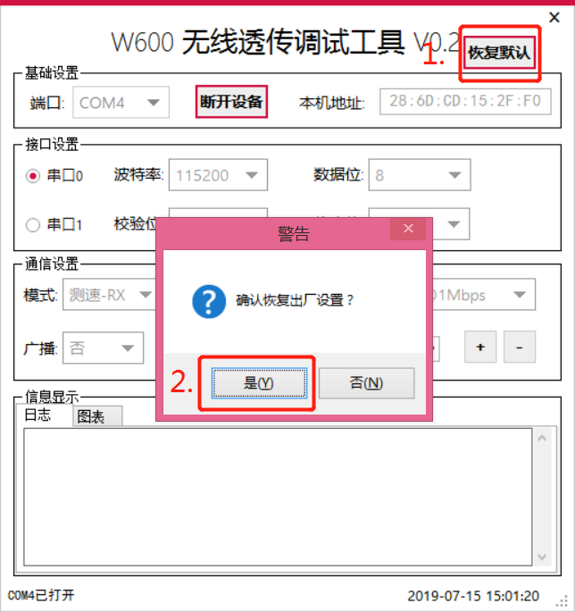 

**5 数据丢包** 

​	目前数据持续发送时，会存在丢包问题，此处仍需完善。

**6 功耗过大** 

​	待完善。

**7 SPI功能** 

​	待完善。

**8 是否开源** 

​	待功能完善后会开源。

