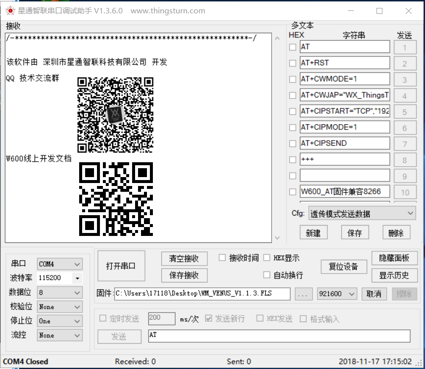

# W600 固件烧录指南

## 1.文件类型

| 编号 |   文件名.后缀     | 说明                                  |
| :--: | :-------------: | :----------------------------------- |
|  1   |   secboot.img   | W600 二级引导程序                                            |
|  2   | WM_W600_GZ.img  | gzip压缩的包含分区信息的img数据文件                          |
|  3   | WM_W600_SEC.img | 包含分区信息的img数据文件**（不推荐使用）**                  |
|  4   |   WM_W600.FLS   | secboot.img+WM_W600.img，包含启动boot和分区信息的img数据文件 |

------

## 2.固件升级方式及要点

|     文件类型     |  支持ROM升级  | 支持Secboot升级 | 支持OTA升级 |
| :-------------: | :---------: | :-------------: | :---------: |
| WM_W600_GZ.img  |   不支持    |      支持       |    支持     |
| WM_W600_SEC.img |   不支持    |      支持       |    支持     |
|   WM_W600.FLS   |    支持     |     不支持      |   不支持    |

**注意：**

  - WM\_W600.FLS不支持OTA升级，云端上放的升级固件不能放WM\_W600.FLS
  - 做OTA升级建议使用WM\_W600\_GZ.img，该文件是压缩格式，相对传输的数据比较小
  - Secboot升级时建议下载WM\_W600\_GZ.img文件，WM\_W600\_SEC.img文件太大可能会破坏用户区数据

本地串口升级分为两种**： ROM升级、SECBOOT升级。

他们的区别在于：

-   ROM升级需要当前升级的文件包含Secboot部分做引导升级，需要烧录后缀为fls的文件
-   SECBOOT升级不需要当前升级的文件包含Secboot，烧录后缀为img的文件，注意，在secboot模式烧录fls文件是无法烧录的

简单来讲，用户如果没有擦除过W600系列产品的flash文件，直接烧录img文件即可，如果擦除过flash文件，则需要烧录fls文件；

如果secboot和image区域被破坏过，建议使用软件直接擦除flash，重新烧录fls文件；

------

## 3.星通智联下载调试软件界面展示

------

## 4.演示

**ROM升级 -通过FLS文件升级**

**Secboot升级-通过img文件升级**

**擦除fls文件操作**

------

## 5.FAQ

**1.如何进入ROM模式烧录fls文件**
  - 拉低W600模块的BOOTMODE(PA0)脚，然后上电（注意模组一般没有引出该引脚，使用芯片设置产品的用户可以考虑引出该引脚）；
  - 使用 星通智联串口下载调试软件 的擦除功能，擦除flash后，默认上电就会进入ROM模式。

**2.在不知道如何烧录固件的情况下的万能烧录方式**

  - 使用星通智联串口下载调试软件的擦除功能，擦除flash；
  - 烧录fls文件。

**3.烧录过程中卡住不动**
  - W600芯片烧录过程中需要手动的重启设备。使用星通智联串口下载调试软件下载时，文本窗口会提示 "reset device" ,此时需要手动的重启设备。

**4.如何设置一键下载**
  - 接线电路时，将模组的复位脚接在串口工具的RTS引脚上，下载的时候可以自动复位。
  - 接上该引脚后，使用星通智联串口下载调试软件，可以点击按键 "复位设备" 达到复位设备的效果。

​

## 6.联系我们

**官 网：** http://www.thingsturn.com

**样品购买：** http://shop.thingsturn.com

**在线文档：** http://docs.thingsturn.com/

**技术咨询：** support@thingsturn.com

**商务咨询：** sales@thingsturn.com

**QQ交流群：**860320067