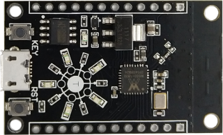
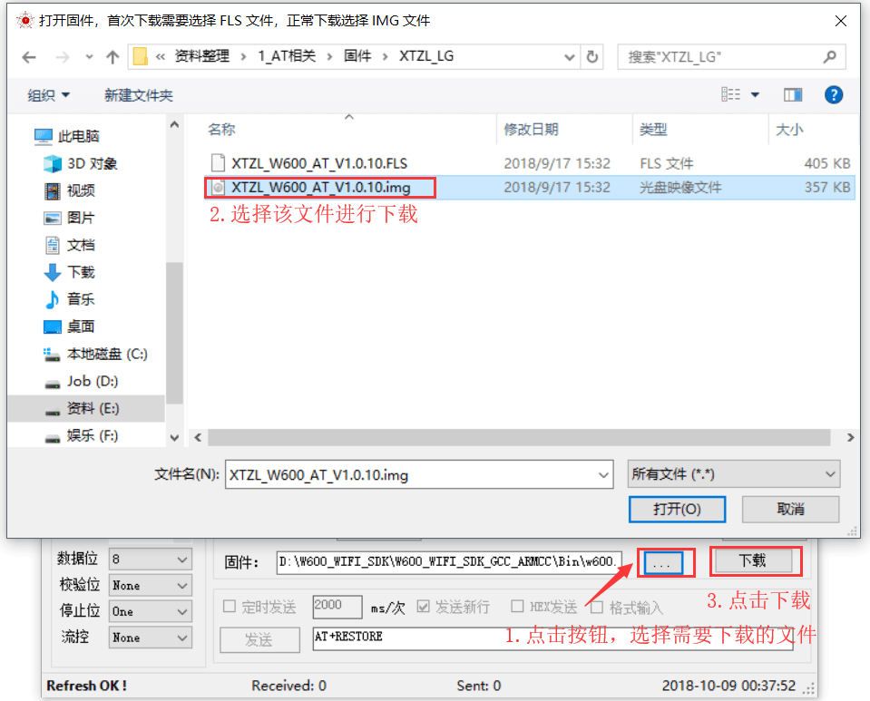
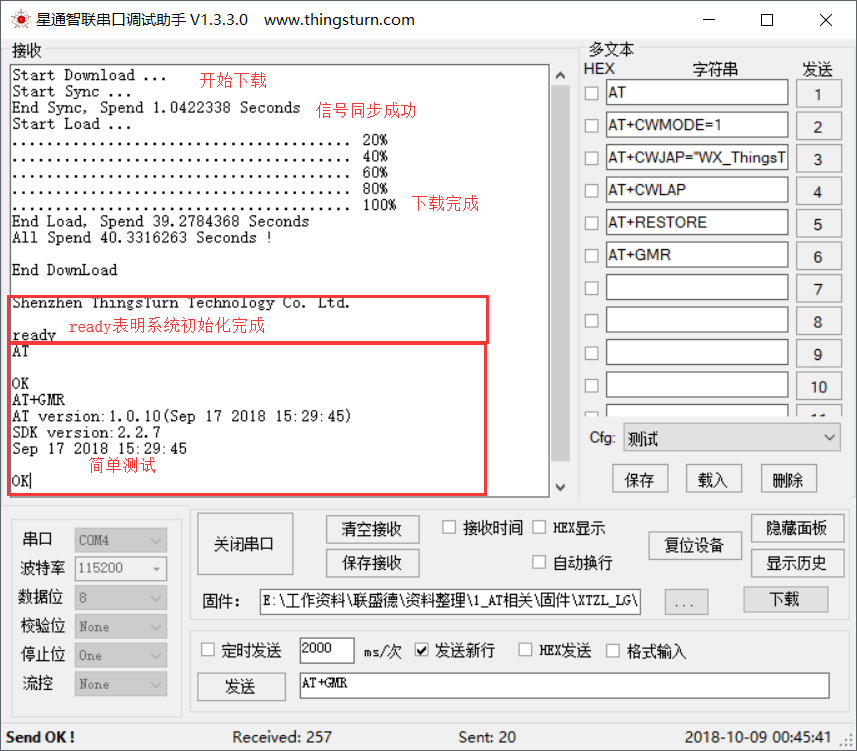
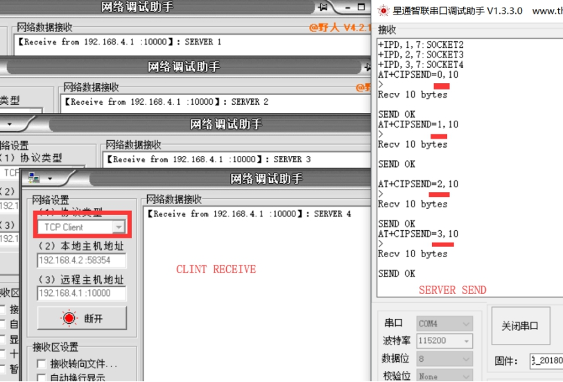
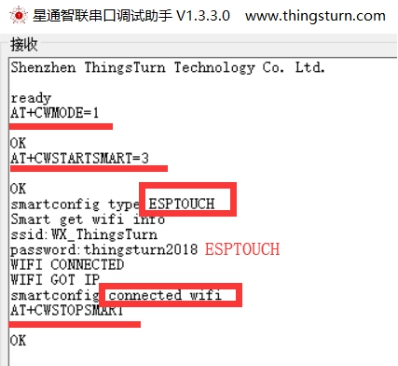
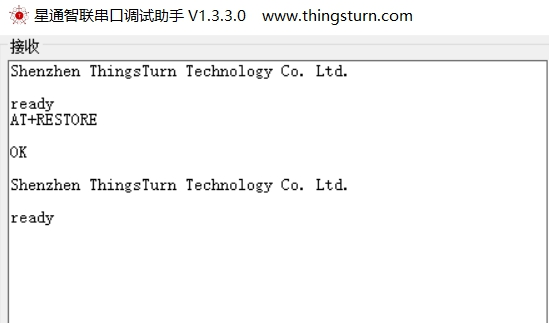

# 兼容版 AT 指令

本文旨在引导客户使用W600系列产品下载调试AT固件，其中包括硬件环境、软件环境、下载固件、调制等步骤。

## 1 准备工作

-   电脑：固件下载当前仅支持Windows操作系统
-   软件：[串口调试助手](https://download.w600.fun/tool/%E6%98%9F%E9%80%9A%E6%99%BA%E8%81%94%E4%B8%B2%E5%8F%A3%E8%B0%83%E8%AF%95%E4%B8%8B%E8%BD%BD%E5%8A%A9%E6%89%8B.7z)
-   固件：[AT兼容固件](https://download.w600.fun/firmware/thingsturn_w600_at_v1.1.6_20190304.7z)
-   硬件：TB-01开发板 或 W600系列模组、开发板（[购买链接](http://shop.thingsturn.com/)）
-   Micro USB线

## 2 开发板介绍

TB-01 是一款基于联盛德 W600 的超小体积核心开发板，该开发板引出了芯片的所有IO，并且内置LDO和UART传输芯片，只需一根 Micro USB 数据线与电脑连接即可使用，支持一键下载，外设拥有5个环形LED和2颗按键，调试操作极其方便。

## 3.固件烧录、测试

-   按照下图操作，使用星通智联串口工具烧录、测试;
-   点击“下载”进行固件下载，`波特率默认使用 115200 bps，支持 2Mbps！`;
-   `烧录遇到问题的用户请参考:` [W600固件烧录指南](../app/download.md)

**到此，已经完成W600系列产品AT固件的下载调试。**

## 4. 参考示例

### 4.1 创建STA与服务器进行TCP通讯

**设备端**：

**1.设置工作模式**

AT+CWMODE=1

响应：

OK

**2.扫描周围路由信息**

AT+CWLAP

响应：

+CWLAP:(4,“ChinaNet-pYvA”,-70,“54:e0:61:15:96:89”,3)

+CWLAP:(4,“ChinaNet-UMSH”,-66,“f0:92:b4:28:c0:31”,3)

+CWLAP:(4,“WX\_ThingsTurn”,-7,“2e:b2:1a:df:98:5b”,7)

OK

**3.设置要加入的AP的参数**

AT+CWJAP=“WX\_ThingsTurn”,“thingsturn2018”

响应：

WIFI CONNECTED

WIFI GOT IP

OK

**4.创建TCP连接**

AT+CIPSTART=“TCP”,“192.168.2.198”,10001
//IP和端口按照实际参数填写，本参数为参考

响应：

CONNECT

OK

**5.发送发送数据的指令**

AT+CIPSEND=5

响应：

\> //出现发送标识符，等待发送数据

**6.发送数据**

12345 //该处为实际发送的参数，不显示

响应：

SEND OK

**7.查询网络连接状态**

AT+CIPSTATUS

响应：

STATUS:3

+CIPSTATUS:0,“TCP”,“192.168.2.198”,10001,50831,0

### 4.2 创建STA与服务器进行透传TCP通讯

**首先执行 一、创建STA与服务器进行TCP通讯**

**设备端**

**1.设置进入透传模式**

AT+CIPMODE=1

响应：

SEND OK

**2.触发透传模式**

AT+CIPSEND

响应：

\> //触发透传模式后，后续可以直接发送数据，不会对指令进行响应

**服务器端：**

**3.服务器端发送数据**

12345

**设备端：**

**4.设备接收到数据:**

Server test

Server test

Server test

**5.退出透传模式**

+++ //不要加回车换行符

响应：

\> //触发透传模式后，后续可以直接发送数据，不会对指令进行响应

### 4.3 创建STA上电保存进入透传模式

**设备端：**

**1.设置工作模式**

AT+CWMODE=1

响应：

OK

**2.扫描周围路由信息**

AT+CWLAP

响应：

+CWLAP:(4,“ChinaNet-pYvA”,-70,“54:e0:61:15:96:89”,3)

+CWLAP:(4,“ChinaNet-UMSH”,-66,“f0:92:b4:28:c0:31”,3)

+CWLAP:(4,“WX\_ThingsTurn”,-7,“2e:b2:1a:df:98:5b”,7)

OK

**3.设置要加入的AP的参数**

AT+CWJAP=“WX\_ThingsTurn”,“thingsturn2018”

响应：

WIFI CONNECTED

WIFI GOT IP

OK

**4.保存透传到flash**

AT+SAVETRANSLINK=1,“192.168.2.198”,10001,“TCP”

响应：

OK

**5.复位**

AT+RST

响应：

OK

**6.退出透传模式**

+++ //不要加回车换行符
注意，无论上电有没有联网成功，模组都会处于透传模式，此时发送任何命令都会以数据的形式发出去，不会被响应

响应：

### 4.4 创建AP作为服务器开启多链接通讯

**设备端**

**1.设置工作模式**

AT+CWMODE=2

响应：

OK

**2.设置要创建的AP的参数**

AT+CWSAP=“ThingsTurn”,“123456789”,5,3

响应：

OK

**3.查询创建的AP的参数**

AT+CWSAP?

响应：

+CWSAP:“ThingsTurn”,“123456789”,5,3,4,0

OK

**4.使能多链接**

AT+CIPMUX=1

响应：

OK

**5.创建服务器**

AT+CIPSERVER=1,10000

响应：

OK

**客户端：**

**注：客户端可以用PC软件或者其他软件模拟，所有客户端必须和设备端再同一个局域网内，否则无法连接通讯。**

**6.使用PC软件或者其他w600系列模组作为客户端连接设备端**

**7.客户端发送数据到服务器**

**设备端**

**8.服务器设备端发送数据到所有的客户端**

### 4.5 智能配网（smartconfig）

**使用智能配网的方式，通过手机让设备连上路由（支持微信、app)**

### 4.6 修改波特率

**注意V1.0.10 版本不支持流控设置**

### 4.7 恢复出厂设置

**注：在调试阶段，一些指令的参数会被保存，上电是自动设置，会影响调试，建议使用AT+RESTORE清除这些配置，而不是使用AT+RST复位。**

## 5 资源下载

[兼容版本AT固件](https://download.w600.fun/firmware/thingsturn_w600_at_v1.1.6_20190304.7z)
[串口下载工具](https://download.w600.fun/tool/%E6%98%9F%E9%80%9A%E6%99%BA%E8%81%94%E4%B8%B2%E5%8F%A3%E8%B0%83%E8%AF%95%E4%B8%8B%E8%BD%BD%E5%8A%A9%E6%89%8B.7z)
[网络调试助手](https://download.w600.fun/tool/NetAssist.exe)

