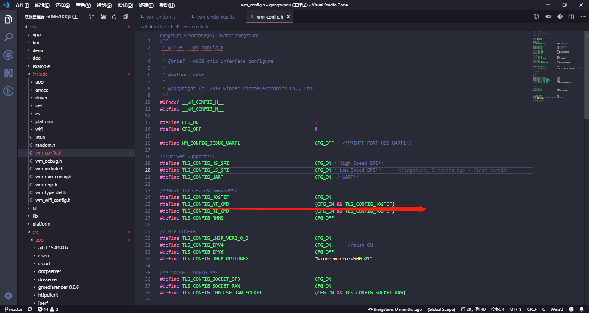
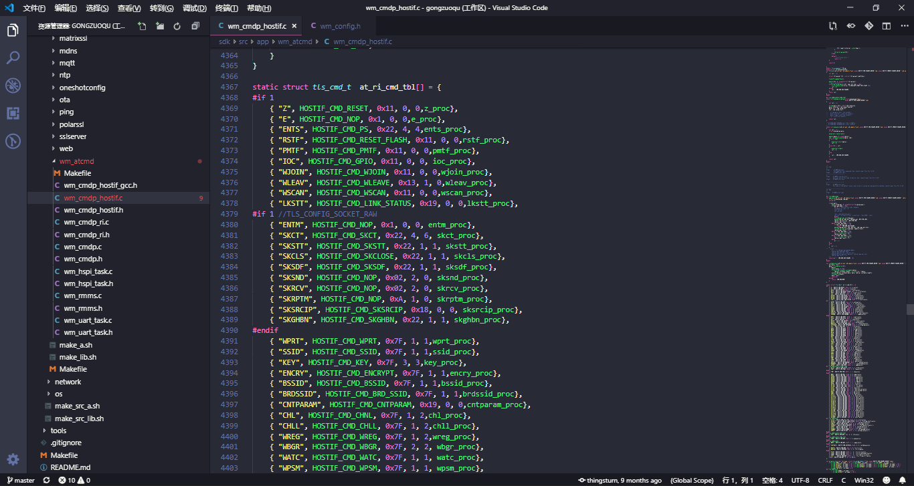
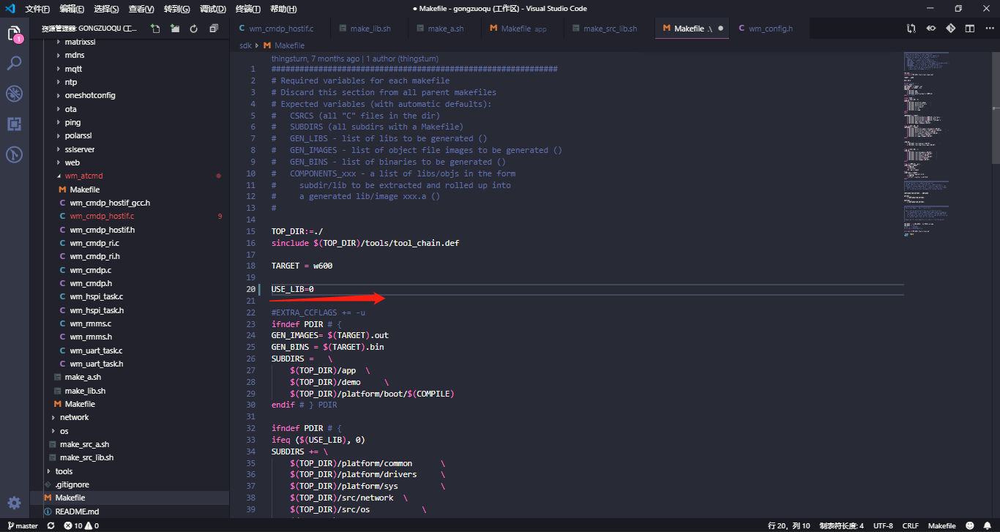
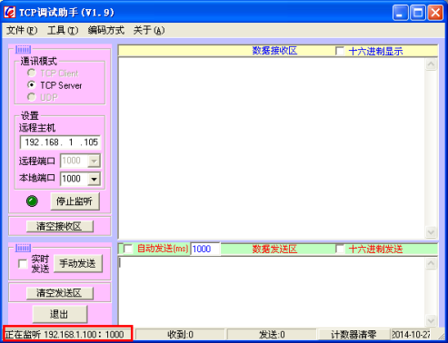
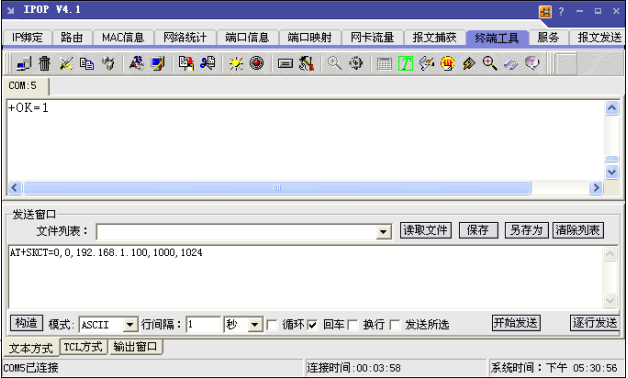
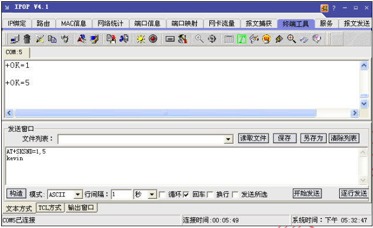
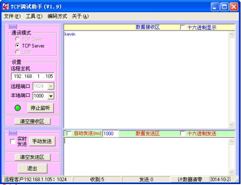
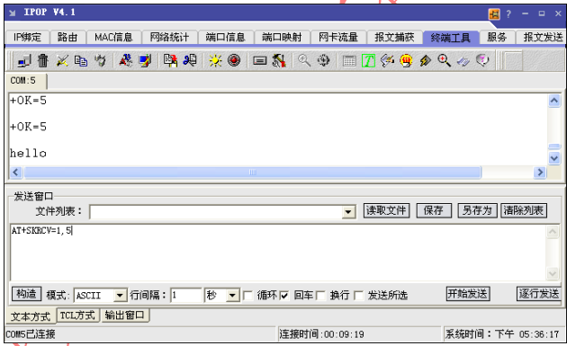
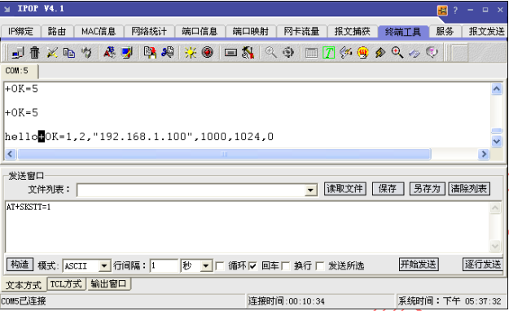
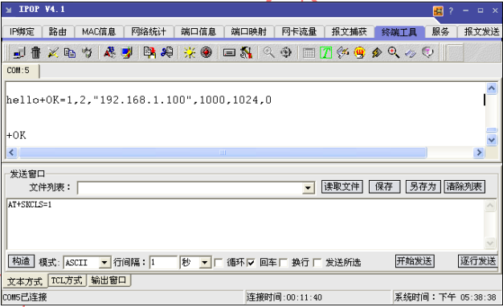

# 联盛德 AT 指令

本文旨在引导客户使用W600系列产品编译和下载调试联盛德版本的AT固件，其中包括硬件环境，软件环境，下载固件，调制等步骤。

## 介绍

该版本为联盛德实现的AT固件，需注意，和兼容版的指令是不同的，sdk默认编译的固件已经开启AT功能，用户可以根据自身需要打开和关闭该AT指令功能

## 准备工作

- 电脑：固件下载当前仅支持Windows操作系统
- 软件：[串口调试助手](https://download.w600.fun/tool/%E6%98%9F%E9%80%9A%E6%99%BA%E8%81%94%E4%B8%B2%E5%8F%A3%E8%B0%83%E8%AF%95%E4%B8%8B%E8%BD%BD%E5%8A%A9%E6%89%8B.7z)
- 固件：[联盛德AT固件](https://download.w600.fun/firmware/at.fls)
- 硬件：TB-01开发板 或 W600系列模组，开发板（[购买链接](http://shop.thingsturn.com)）
- Micro USB线
- 文档：[WM_AT指令集手册](https://download.w600.fun/document/W60X_SDK_AT%E6%8C%87%E4%BB%A4%E7%94%A8%E6%88%B7%E6%89%8B%E5%86%8C.pdf)

## 步骤

- SDK中AT指令实现代码全部开源，用户也可以基于需求开发自己的AT指令
- 通过修改sdk->include->wm_config.h下的宏定义可以开启AT指令功能

- AT代码实现位于sdk->src->app->wm_atcmd目录下

## 常见问题

- 模块出厂默认会烧录兼容版本AT固件，如需使用联盛德版本AT固件和自己修改可以另外烧录联盛德版本AT固件
- 如果修改过AT指令部分源码，编译时注意直接编译源码或者重新编译源码重新生成库文件，通过修改Makefile文件下的USE_LIB=0可直接编译源码生成固件

## 参考示例

- 建立一个 PC 端的 TCP server，如使用 TCP 调试助手， TCP server 地址为192.168.1.100，监听端口为 1000

  

  建立 Socket： 

  TX: AT+SKCT=0,0,192.168.1.100,1000,1000
  RX: +OK=1 ---> 1 为 socket 号 

  

  发送数据： 

  TX: AT+SKSND=1,5
  kevin
  RX： +OK=5 

  

  TCP server 接收到数据界面为： 

  接收数据： 

  

  在 TCP 调试助手界面输入发送数据 hello，点击发送。 

  TX： AT+SKRCV=1,5
  RX： +OK=5
  hello 

  

  查询 Socket 状态：
  TX： AT+SKSTT=1
  RX： +OK=1,2,"192.168.1.100",1000,1024,0 

  

  关闭 Socket 连接
  TX： AT+SKCLS=1
  RX： +OK  

  

   

- STA如何断开连接的AP

  无线网卡断开AP的AT指令为：AT+WLEAV

  

- STA如何查看当前状态

  无线网卡查看当前网卡的状态的AT指令为：AT+LKSTT

  

- 创建AP流程

  WPRT	设置无线网卡工作模式为AP

  AT+WPRT = 2

  SSID	设置无线网卡对于STA的网络名称MyAp

  AT+APSSID=MyAp

  ENCRY	设置无线网卡安全模式为WEP64

  AT+ENCRY=1

  参数：open：0，WEP64：1，WEP128：2

  KEY		设置无线网卡密钥12345678

  AT+APKEY=1,1,12345678

  参数1：密钥格式，0表示HEX，1表示ASCII

  参数2：index：密钥索引号，1~4用于WEP加密密钥，其他加密方式固定为0

  参数3：无线密钥。例如：1234678

  APNIP		设置ip地址和子网掩码

  AT+APNIP=1,192.168.1.1,255.255.255.0,192.168.1.1,192.168.1.1

  参数1：地址类型，0表示使用DHCP动态分配，1表示静态地址

  参数2：IP：192.168.1.1

  参数3：netmask：255.255.255.0

  参数4：gateway：192.168.1.1

  参数5：dns:	192.168.1.1

  PMTF	保存参数到spi flash

  AT+PMTF

  Z		复位无线网卡

  AT+Z

  延时1秒

  WJOIN	创建无线网络My'A'p

  AT+WJOIN

  

- 创建 APSTA 流程 

  WPRT	设置工作模式为APSTA

  AT+WPRT=3

  SSID	设置需要加入的AP名称如WinnerMicro

  AT+SSID=WinnerMicro

  KEY		设置需要加入的AP的无线密钥12345678

  AT+KEY=1，0，12345678

  参数1：密钥格式，0表示HEX，1表示ASCII

  参数2：index，密钥索引号，1~4用于WEP加密密钥，其他加密方式固定为0

  参数3：无线密钥。例如：12345678

  SSID2	设置创建的SOFTAP的网络名称

  AT+APSSID="MYSoftAP"

  NIP		启动DHCP

  AT+APNIP=0

  PMTF	保存参数到spi flash

  AT+PMFT

  Z		复位无线网卡使能配置生效

  AT+Z

  延时1秒

  WJOIN	加入无线网络WinnerMicro

  AT+WJOIN

  

  ### 资源下载

  [联盛德AT固件](https://download.w600.fun/firmware/at.fls)

  

