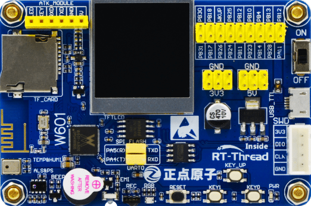
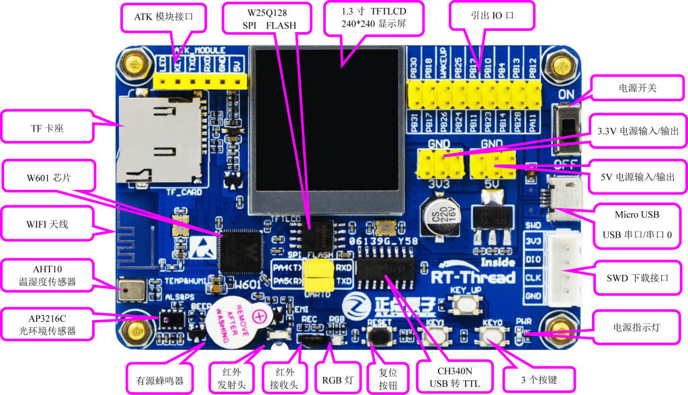

# 正点原子W601全功能开发板

## 概述

W601 全功能开发板是由**联盛德、正点原子、RT-Thread**三方联合推出的一款超高性价比物联网开发板。

具备以下特点：

*   小巧精致。开发板布局紧凑，丝印清晰美观，方便携带，可随时享受开发的乐趣。

*   接口丰富。包括温湿度传感器、距离感应传感器与LCD等外设，可进行大量实验，DIY喜欢的产品。

*   简单易用。开发板仅需一根micro USB线即可实现供电、串口日志输出等功能。并且板载WiFi天线，方
    便接入网络。

## 接口资源

## 资料下载

[光盘资料汇总下载](https://eyun.baidu.com/s/3hueg2EC)

## 其它

[RT-Thread-Github](https://github.com/RT-Thread/W601_IoT_Board)

[RT-Thread文档中心](https://www.rt-thread.org/document/site/)

[正点原子开发论坛](http://openedv.com)

[正点原子W601开发板QQ交流群：797416020](https://jq.qq.com/?_wv=1027&k=5fcxk5i)