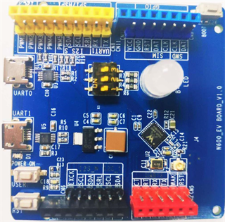

# W600 Arduino 开发板

## 概述

arduino 开发板是用来给开发人员测试验证W600功能的开发板。该开发板支持标准的802.11 b/g/n 协议，内置完整的 TCP/IP 协议栈。

## 特性

-   采用Cortex-M3 处理器，主频高达80MHz
-   内置8Mbit Flash
-   内置 288KB SRAM，用户可用超过160KB
-   支持UART/SPI/SDIO/PWM/I2S/I2C等接口
-   集成双工I²S控制器，支持32KHz\~192KHz
-   硬件支持多种加解密协议
-   支持SWD 调试
-   集成 Wi-Fi MAC/ BB/RF/PA/LNA
-   支持HT40，wifi速率最高150Mbps
-   支持 STA/AP/STA+AP 工作模式
-   支持 OneShot / AirKiss 一键配网
-   串口速率最高可达2Mbps
-   通用AT指令可快速上手
-   支持串口本地升级和远程固件升级（FOTA）
-   开发环境支持keil,Eclipse

## 资料下载

[WM\_Arduino开发板使用指导](https://download.w600.fun/document/WM_Arduino%E5%BC%80%E5%8F%91%E6%9D%BF%E4%BD%BF%E7%94%A8%E6%8C%87%E5%AF%BC.pdf)

[WM\_Arduino开发板硬件设计资料](https://download.w600.fun/hardware/Arduino_Hardware_design_file.zip)

## 其它

[W600 Arduino 入门指南](../arduino/start.md)

[W600 Arduino 源码](https://github.com/w600/arduino)

