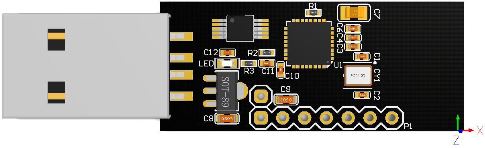
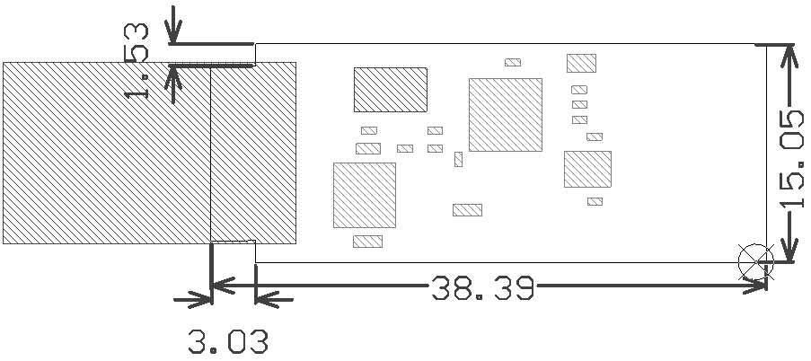
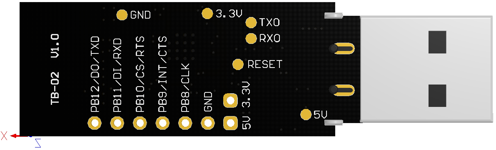
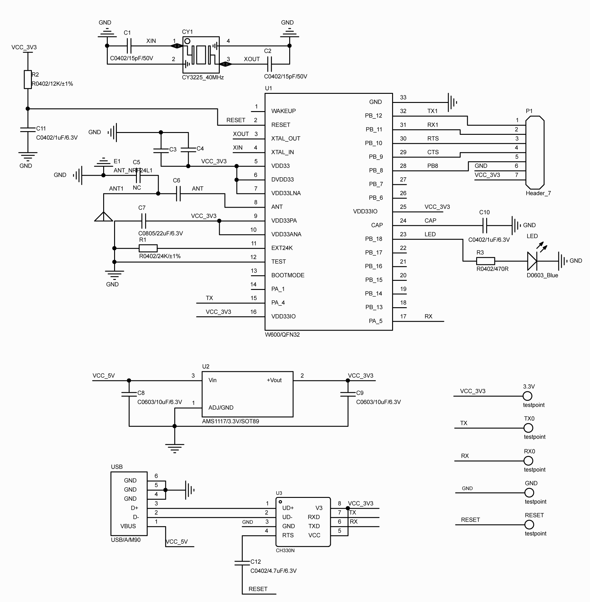

# TB-02 开发板

## 概述

TB-02是星通智联基于联盛德 W600自主研发设计的一款超小体积USB核心开发板。支持UART0+USB传输，UART1传输，SPI传输等方式与外部连接，板载一颗状态LED（GPIO：PB18）、内置CH340E串口芯片，调试方便，体积小巧，外设丰富，非常适合WIFI中继，探针、广告机、透传等应用场景。

TB-02提供无线透传固件以及配套上位机软件，供用户下载使用。

## 尺寸图

## 引脚说明

## 内部原理图

## 其他

[出厂固件下载](https://download.w600.fun/firmware/thingsturn_tb02_firmware_20190821.fls)

[配套透传工具下载](https://download.w600.fun/tool/ThingsTurn_Wireless_Config_Tools.7z)

