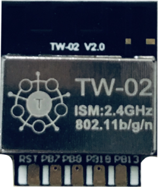
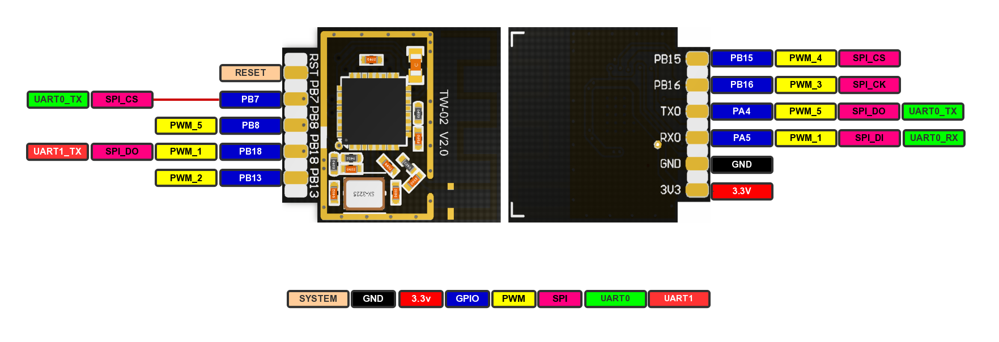

# TW-02 WiFi 模组

## 概述

TW-02无线模块是星通智联自主研发设计的一款高性价比Wi-Fi
SOC模组。该系列模块支持标准的 802.11 b/g/n 协议，内置完整的 TCP/IP
协议栈。

## 特性

-   采用 Cortex-M3 处理器，主频高达 80MHz
-   内置 8Mbit Flash
-   内置 288KB SRAM，用户可用超过 160KB
-   支持 UART/SPI/PWM/I2S/I2C 等接口
-   集成双工 I²S 控制器，支持 32KHz\~192KHz
-   硬件支持多种加解密协议
-   支持 SWD 调试
-   集成 Wi-Fi MAC/BB/RF/PA/LNA
-   支持HT40，wifi速率最高150Mbps
-   支持 STA/AP/STA+AP 工作模式
-   支持 OneShot / AirKiss 一键配网
-   串口速率最高可达 2Mbps
-   通用 AT 指令可快速上手
-   支持串口本地升级和远程固件升级（FOTA）
-   开发环境支持keil,Eclipse

## 引脚说明

## 资料下载

[TW-02 规格书](https://download.w600.fun/document/TW-02_%E4%BA%A7%E5%93%81%E8%A7%84%E6%A0%BC%E4%B9%A6.pdf)

[TW-02 引脚封装 ](https://download.w600.fun/hardware/TW-02_Module.zip)

