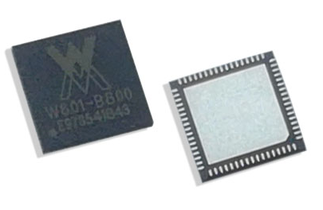
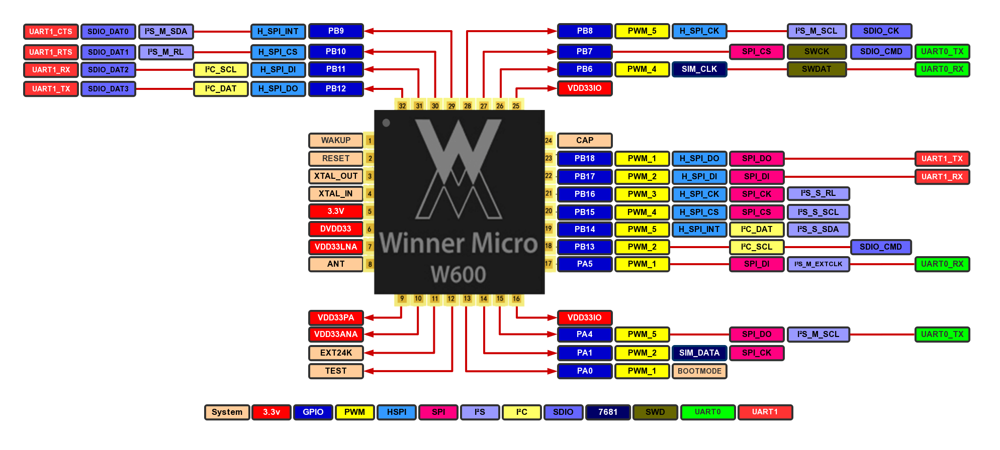

# W601 简介

W601是北京联盛德自主研发设计的一款嵌入式WiFi芯片，该系列模块支持标准的802.11 b/g/n 协议，内置完整的 TCP/IP 协议栈。

W600\_SoC芯片集成 Cortex-M3 内核，内置 Flash，集成射频收发前端 RFTransceiver，CMOS PA 功率放 大器，基带处理器/媒体访问控制，支持 SDIO、SPI、UART、GPIO、I²C、PWM、I²S、7816、LCD、ADC 等接口, 支持多种加解密协议，如 PRNG(Pseudo random Number Generator)/ SHA1/ MD5/ RC4/DES/ 3DES/ AES/ CRC 等。

W600是一款支持多接口、多协议的无线局域网 IEEE802.11n（1T1R）的 SoC 芯片。适用于智能家
电、智能家居、无线音视频、智能玩具、医疗监护、工业控制等物联网应用领域。

## W601 特性

1.  内置 288KB SRAM，用户可用RAM超过160KB；
2.  内置 1MB Flash，用户固件大小可达511KB；
3.  支持SWD调试；
4.  支持HT40，WiFi速率最高150Mbps；
5.  集成 GPIO 控制器，支持48位可控制 GPIO；
6.  集成1个高速SPI设备控制器，工作时钟范围0\~50MHz；
7.  集成1个I2C控制器，支持100/400Kbps速率；
8.  2个完整UART接口，波特率范围1200bps\~2Mbps；
9.  集成双工I²S控制器，支持32KHz\~192KHz 编解码；
10.  集成PWM控制器，支持5路PWM输出或2路PWM输入；
11.  集成7816接口，支持EVM2000规范，并兼容串口功能；
12.  集成 LCD 控制器，支持 4x20/8x16 接口，支持2.7V~3.6V 电压输出；
13.  集成通用加密硬件加速器，支持PRNG/ SHA1/ MD5/ RC4/ DES/ 3DES/ AES/CRC等多种加解密协议；
14.  除 wlan.lib 外，其它资源完全开放；
15.  使用 keil 开发环境;
16.  支持 gcc 开发。

## 引脚说明

## 资源下载

[W601_芯片产品规格书](https://download.w600.fun/document/W601_%E8%8A%AF%E7%89%87%E4%BA%A7%E5%93%81%E8%A7%84%E6%A0%BC%E4%B9%A6.pdf)

[W601 寄存器手册](https://download.w600.fun/document/W601_%E5%AF%84%E5%AD%98%E5%99%A8%E6%89%8B%E5%86%8C.pdf)

