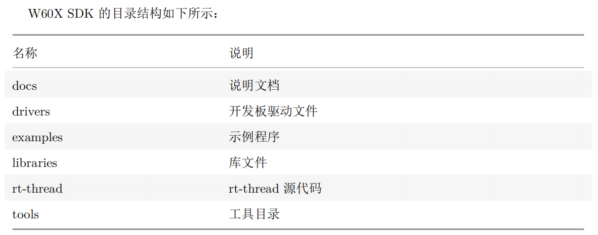
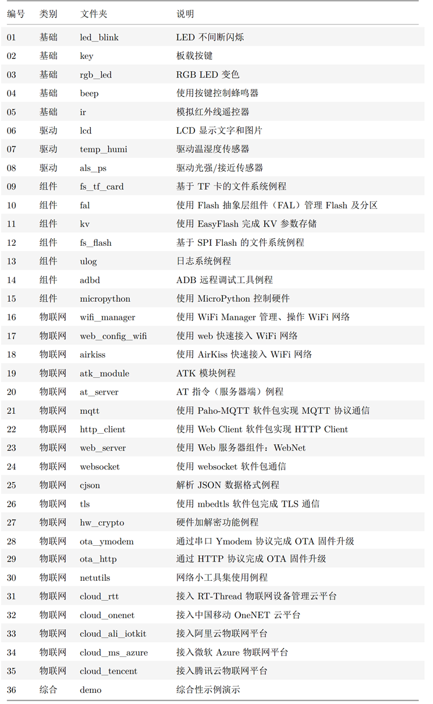
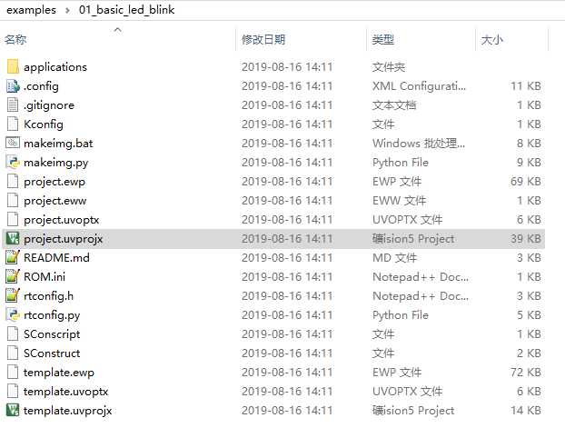
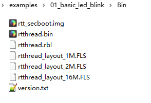

# W60x RT-Thread 入门指南

## 1.RT-Thread 简介

[RT-Thread](http://www.rt-thread.org/) 是一个来自中国的开源物联网操作系统，它具备非常强的可伸缩能力：从一个可以运行在ARM Cortex-M0 芯片上的极小内核，到中等的 ARM Cortex-M3/4/7系统，甚至是运行于 MIPS32、ARM Cortex-A 系列处理器上。 RT-Thread项目的源代码托管在 [GitHub repo](https://github.com/rt-thread) 上。

## 2.准备工作

-   W60x\_RT-Thread源码：（请先使用GitHub版本 <https://github.com/RT-Thread/W601_IoT_Board>）
-   RT-Thread env工具：https://github.com/RT-Thread/env
-   串口下载工具：[串口调试助手](https://download.w600.fun/tool/%E6%98%9F%E9%80%9A%E6%99%BA%E8%81%94%E4%B8%B2%E5%8F%A3%E8%B0%83%E8%AF%95%E4%B8%8B%E8%BD%BD%E5%8A%A9%E6%89%8B.7z)
-   正点原子W601全功能开发板（[购买链接](http://shop.thingsturn.com/)）

## 3.环境搭建

### 3.1编译环境搭建

该SDK可以由Keil直接编译，详情参考[W600 开发环境搭建指南](../app/ide)

### 3.2 工程目录介绍

docs文件夹下放着W600\_RTT相关的参考文档，建议先阅读 `UM3103-RT-Thread-W60X-SDK 快速上手.pdf `和 `UM3101-RT-Thread-W60X-SDK开发手册.pdf`

## 4.编译烧录

### 4.1 编译

W600\_RT-Thread\_SDK 一共提供了35个示例

进入任意一个示例，双击 `project.uvprojx`工程文件，直接编译即可（注意，一定要先搭建好Keil环境）。

固件生成在当前示例所在目录的Bin文件夹下。

### 4.2 烧录

注意事项：

1.  正点原子w601开发板外挂一颗16Mbyte的FLash，因此可以烧录 `rtthread_layout_16M.FLS`
2.  除特殊说明外，W600和W601均为1M版本，对应 `rtthread_layout_1M.FLS`；
3.  2M版本的芯片/模块/开发板，对应 `rtthread_layout_2M.FLS`；
4.  rbl后缀文件为OTA所需文件，也可直接进行下载更新，类似于W600原厂SDK的img文件；
5.  rtt_secboot.img为RT-Thread定制版本secboot，与原厂secboot.img并不通用，切换版本时需烧录FLS文件，尽量勾选擦除，以免出错。
6.  其它烧录问题请参考:[W600固件烧录指南](../app/download.md)

## 其它

[正点原子W601开发板QQ交流群：797416020](https://jq.qq.com/?_wv=1027&k=5fcxk5i)

