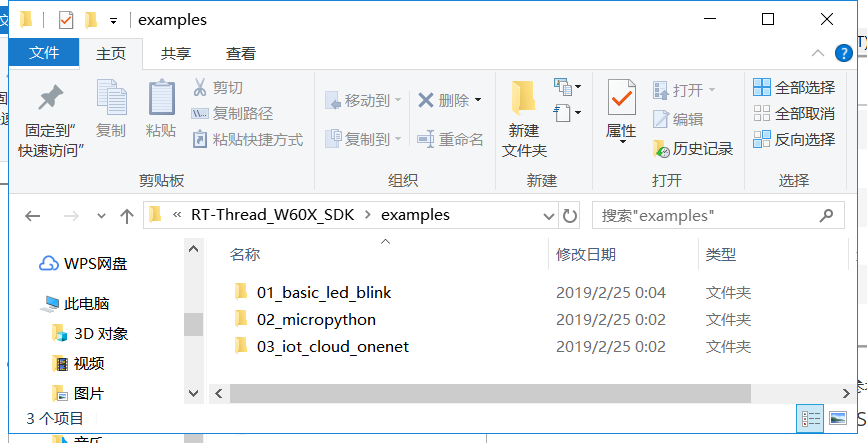
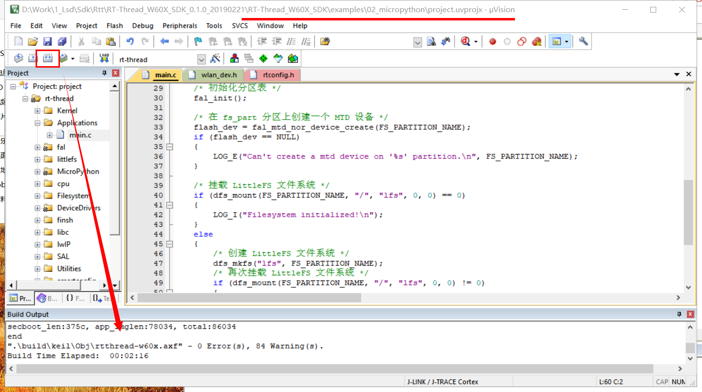
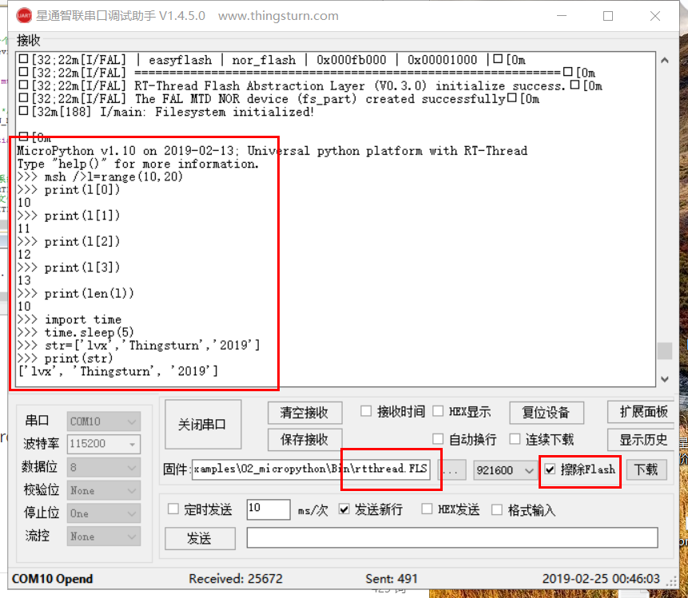

# W600 RT-Thread 入门指南

## 1.RT-Thread 简介

[RT-Thread](http://www.rt-thread.org/) 是一个来自中国的开源物联网操作系统，它具备非常强的可伸缩能力：从一个可以运行在ARM Cortex-M0 芯片上的极小内核，到中等的 ARM Cortex-M3/4/7系统，甚至是运行于 MIPS32、ARM Cortex-A 系列处理器上。 RT-Thread项目的源代码托管在 [GitHub repo](https://github.com/rt-thread) 上。

## 2.准备工作

-   W600\_RT-Thread源码：（暂不提供下载， 请先使用GitHub版本 <https://github.com/rt-thread>）
-   RT-Thread env工具：https://github.com/RT-Thread/env
-   串口下载工具：[串口调试助手](../tools/serial)
-   开发板 TB-01开发板（[购买链接](http://shop.thingsturn.com/)）

## 3.环境搭建

### 3.1编译环境搭建

该SDK可以由Keil直接编译，详情参考[W600 开发环境搭建指南](../app/ide)

### 3.2 工程目录介绍

docs文件夹下放着W600\_RTT相关的参考文档，建议先阅读UM3103-RT-Thread-W60X-SDK 快速上手.pdf 和 UM3101-RT-Thread-W60X-SDK开发手册.pdf

## 4.编译烧录

### 4.1编译

W600\_RT-Thread\_SDK（体验版）提供了三个Demo，让用户体验W600\_RT-Thread的特别之处，找到目录RT-Thread\_W60X\_SDK\\examples，进入各个Demo中双击project.uvprojx工程文件，直接编译即可（注意，一定要先搭建好Keil环境）。

固件生成在RT-Thread\_W60X\_SDKexamplesBin目录下\`。

### 4.2 烧录

可烧录文件为xxx.fls（文件名后缀为.fls）；

烧录方式参考如下截图（截图为Demo:02\_micropython的演示效果）；

烧录遇到问题的用户请参考:[W600固件烧录指南](../app/download)

