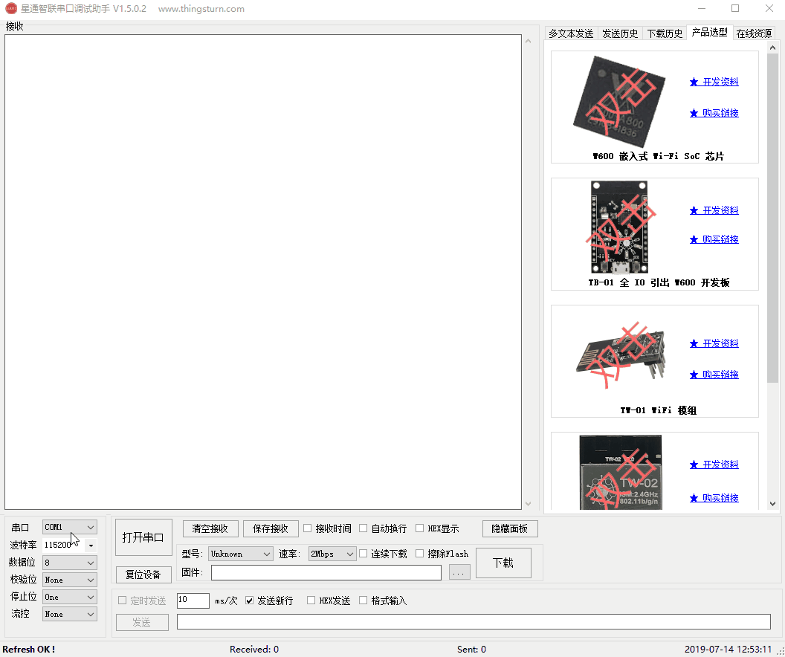
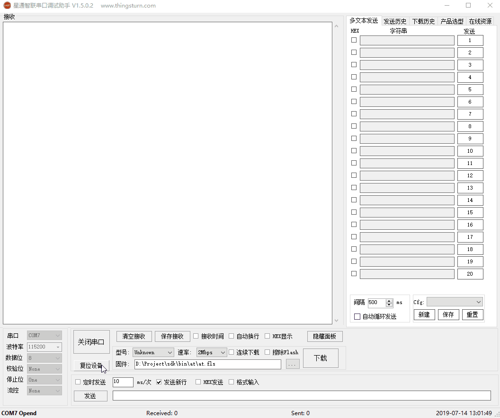
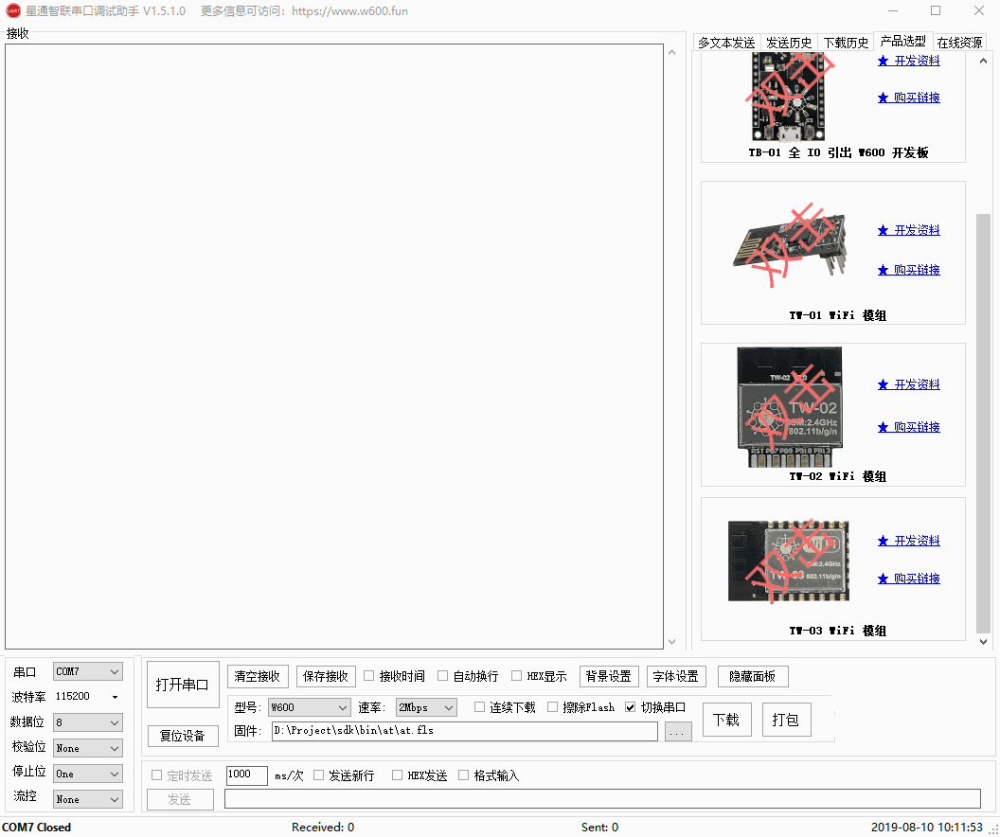
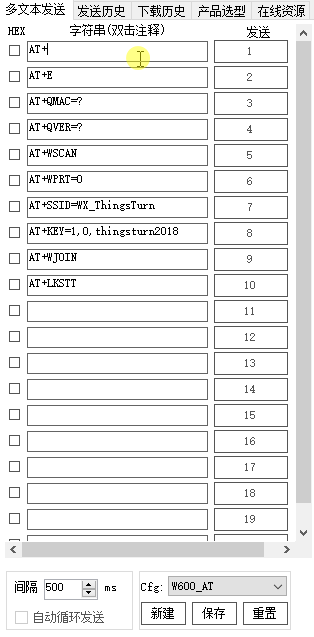

# 串口调试下载助手

## 介绍

**下载工具特性：**

1.  支持自动识别 IMG文件、FLS文件、RBL文件，SECBOOT文件等；

2.  支持擦除用户参数区；

3.  支持**2Mbps**高速串口下载；

4.  支持下载前读取MAC地址信息；

5.  支持连续下载，间隔5秒，持续下载；

6.  支持在下载后自动复位设备（需串口硬件连接支持）。

7.  支持Gain值信息读取和写入，支持型号选择和自定义配置；

8.  支持旧版本SECBOOT（SDK V2.8之前）更新，需下载2次。

9.  支持下载列表，选择对应日期，可查看所选择日期对应的下载文件。

10.  支持固件打包功能，打包后的EXE支持自定义标题；

**串口工具特性**

1. 支持硬件复位W600；
2. 支持接收时间打印；
3. 支持自定义波特率；
4. 支持串口异常中断提示；
5. 支持多文本发送历史显示；
6. 支持接收数据时自动转换\n为\r\n；
7. 支持自定义多文本配置和多文本循环发送；
8. 支持接收数据保存，可选保存为hex或者文本；
9. 支持多文本注释功能，F2重命名，Enter确认，ESC取消；
10. 界面致敬 [丁丁串口工具](http://www.daxia.com/sscom) ，感谢经典，本工具在数据处理稳定方面依旧需要学习。

**其它特性**

1.  支持永久自动更新；
2.  支持启动窗口根据分辨率和比例自适应大小；
3.  串口列表下拉时可以显示对应串口的描述信息；
4.  支持显示在线资源，可以快速找到一些常用的资料；
5.  支持产品选型，双击可以查看对应模组的详细IO定义和功能复用；

## 界面演示

**下载演示**

**多文本发送演示**

**打包功能演示**

**自定义多文本按钮演示**

## 资源下载

[最新版本下载地址](https://download.w600.fun/tool/ThingsTurn_Serial_Tool.7z)

## 常见问题

*   需安装 [DotNetFx40 Framework](https://www.microsoft.com/en-us/download/details.aspx?id=17718) 框架；

*   串口需根据实际芯片型号下载并安装对应的串口驱动

